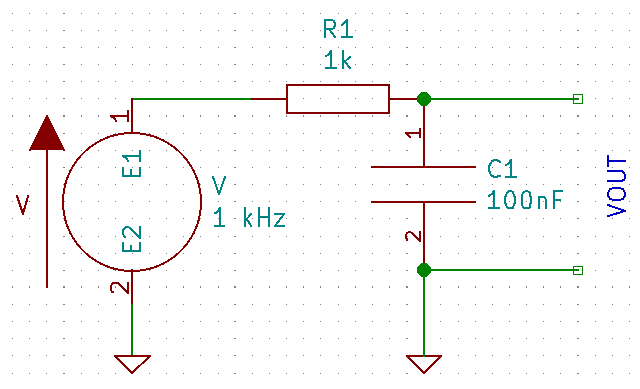
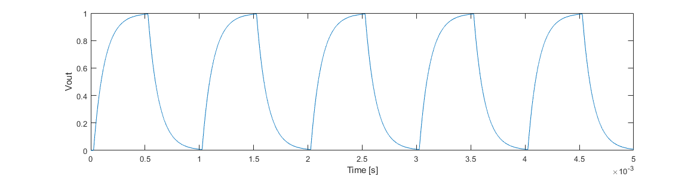
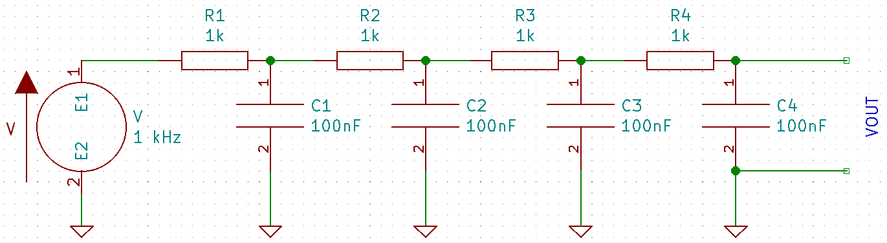
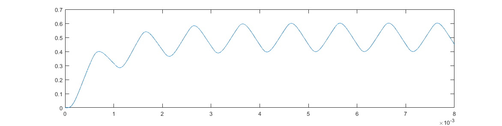
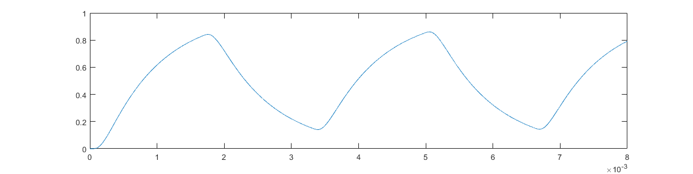

+++
title = "Audio Modems and the PIC"
date = 2020-01-09T21:59:07-08:00
weight = 10
toc = true
katex = true
+++

Normally, audio signal processing is done on a dedicated digital signals programming (DSP) chip&mdash;there's a reason that a multiply and accumulate (MAC) instruction is the first one added, since there's a lot of that to go around when processing a more complicated tone of any sort.
We'll start by looking at what it takes to simply generate and receive clean audio tones when using the PIC, and discuss some more involved signal processing that can improve robustness and enable multiple tone detection at the cost of significant processing time[^picisslow].
The rest of this document assumes a PIC16F15356, although differences on different processors will be called out where relevant.

[^picisslow]: At least, on a PIC that doesn't have a hardware multiply, is 8-bits, and running on only a  clock.

### Analog Modulation

Analog modulation works by taking a _carrier_ and modulating its parameters using the data to be encoded, so that the carrier can transmit the data to whoever you're talking to.

If we look at a pure sine wave as a possible carrier, then what parameters do we have available to modulate?
We might describe the carrier wave as follows:

$$ C = A \sin{\omega t + \phi} $$

Where \\(A\\) is the amplitude, \\(\omega\\) the frequency[^radians], and \\(\phi\\) the phase[^againrad].

[^radians]: In radians per second; the frequency in cycles per second (i.e. Hertz) is given by \\(f = \frac{\omega}{2 \pi}\\).
[^againrad]: Again, in radians.

**Amplitude** is the most natural modulation; for example, we can encode a `1` as a loud tone, and a `0` as a soft tone.
However, this method is not very robust to variations in the communication channel: how do you tell if the transmitting device is just farther from the microphone today, or transmitting all zeros on purpose? Is that just someone clapping in the background, or a set of ones?

What if we encode the data as variations rather than absolute levels?
This will work&mdash;this is how AM radio works&mdash;but the data rate is much lower than the carrier wave frequency.

**Frequency** is probably the next most natural modulation; by choosing different frequencies, we can communicate different information[^python].
Frequency relies on time implicitly, and since time isn't affected by a non-ideal transmission channel, this method is more robust than the amplitude modulation above[^doppler].
This type of modulation is known as _frequency shift keying_ (FSK).
Typically, one frequency will be defined as the "mark" frequency, and will encode a `1`.
Another frequency will be defined as the "space" frequency, encoding `0`.
When used with only two frequencies, this method is called _binary_ frequency shift keying (BFSK).
However, there's nothing magic about choosing only two frequencies: by choosing four frequencies, for example, each symbol can encode a dibit, potentially doubling the data rate.
The limitation is the ability of the receiver to distinguish closely spaced frequencies, and the bandwidth available in the carrier.

[^python]: For a reference implementation of this method in action, see the "Police Station (Silly Voices)" sketch from Monty Python's Flying Circus, Series 1, Ep. 12: _The Naked Ant_.
[^doppler]: Of course, this will still have issues if one of you is moving toward and away from the microphone or speaker at an appreciable fraction of the speed of sound. Or if you're traveling at relativistic speeds and time behaves differently. Or if you're trying to communicate between a Nitrogen and Helium atmosphere. But for most cases, it works great!

Dual-Tone Multiple Frequency (DTMF) encoding can also be used.
You've most likely seen this if you've dialed an actual landline telephone[^landline].
There are several possible frequencies, and for any given symbol, two tones are superimposed, and the combined tone represents the information.
In the case of a phone, 4 "low" frequencies correspond to each row of the keypad, and 4 "high" frequencies correspond to each column of the keypad[^keypad].
For DTMF as implemented on a phone, this means 8 tones encode 16 symbols.
If the restriction of exactly one tone from each set is relaxed, then \\(n\\) tones can encode \\(n(n-1)/2\\) symbols.
If you define your own system and allow either 1 or 2 tones, this gives you \\(n(n+1)/2\\) symbols from \\(n\\) tones.

[^keypad]: Yes, I said 4 columns! The characters are A, B, C, and D, although keypads actually using those buttons were phased out way before DTMF on actual phones was. The corresponding tones are often used as control signals.
[^landline]: Let's be real, this is rapidly approaching the point of "No one but Ed has had this experience," if we're not already there yet.

**Phase** modulation is the last possible modulation, as the description of the sine wave only has three parameters.
Phase is only defined with respect to another reference&mdash;the phase of a single sine wave in isolation isn't well defined.
Like with amplitude, phase modulation can be done relative to the previous value of the carrier.
Phase modulation is used in many commercially implemented systems, as it offers advantages in data rate for a given bandwidth.
However, the modulation and demodulation are more complex, and so we won't consider this mode further here.

### Tone Generation

We'll start with the transmission side of the communication channel: how do we get nice tones out of our PIC?

#### Single Tones

Let's start with the simpler case: Let's say we want to generate tones of only one frequency at a time, alternating between two or more tones to convey information.

The easiest way to generate a frequency on a PIC is to use the CCP peripheral, set it up to control an output pin, and generate a square wave.  
A square wave isn't very nice as an audio source though&mdash;a square wave contains all the harmonics of the frequency of the signal you're generating, and so if any of the components you're using to transduce the voltage signal to or from actual audio have any resonances, they'll almost certaily be excited.

The obvious solution is to filter it.
Let's generate a  square wave between  and , and add an RC filter with a corner at :



If we look at VOUT, we get the following:



which still has sharp edges and enough of the harmonics to possibly cause issues.
Let's add three more filter stages:



If we look at VOUT, we get the following:



which has only  error from a pure sine wave at .
However, instead of a peak to peak amplitude of , we're left with a peak to peak amplitude of only .
Worse, let's say we want to transmit a range of tones, and so we feed the same filter with :



Not only are we back to more of a sharktooth shape due to the harmonics at  and , the peak-peak amplitude is now , which is nearly 4 times higher.
Using a passive filter like this, while simpler to implement in software, reduces signal amplitude and reduces the available frequencies to a small range[^frequencies].
For the specific hardware we're using, the resulting low peak-peak amplitude is small enough that the speaker volume will not be high enough to robustly transmit information.

[^frequencies]: If we assume an ideal filter such that all frequencies below the filter bandwidth \\(f_\mathrm{BW}\\) are passed with unity gain, and all frequencies above are perfectly blocked, the range of usable frequencies is \\(\frac{1}{3}f_\mathrm{BW} < f < f_\mathrm{BW}\\). Since the filter rolloff is not ideal, the available frequency range will be smaller; if roughly equal amplitude is required, it will be smaller still.

Generation of constant-amplitude sine waves can be achieved by using the digital-to-analog converter (DAC) peripheral on the 16F15356.
The DAC has 5-bit resolution, and outputs a constand analog voltage.
By using a lookup table and changing the DAC output at periodic intervals, a sine wave can be approximated.

{}
Why do we want to use a loookup table and not just compute the value on the fly?  It all comes down to processing time.

While a purpose-built chip intended for DSP might have the appropriate hardware instructions and clock speed to actually compute a sine function in real time, doing so would require a lot of floating-point math.
Even on chips with floating-point implemented in hardware, this will be much slower than using integer math everywhere.
On a processor like the PIC16F15356, with no hardware multiply, 8-bit word size, and a relatively low clock, doing even integer multiplication and division can be too much computation to fit into a high-rate interrupt.

Using a lookup table means that we can do all of the math ahead of time.
Usually, this means when we're writing our code, doing the computations on a proper computer and inserting a const array in the program.
Sometimes, this can mean computing the lookup table in code, but doing it slowly outside an interrupt while there are no time-critical functions running&mdash;if the lookup table depends on measurements made while your code is running, for example.

A lookup table doesn't necessarily have to be a direct representation of a waveform either.
If you needed to actually compute sines on a microcontroller, you'd typically include a lookup table `sineTable` such that `sineTable[d]` held the value of \\(\sin \frac{d}{2\pi}\\), for example.
{}


The DAC output has a high source impedance, and so it should be unity buffered; as the output is a stepped sine wave, it must also be filtered to remove harmonics.
However, here a single RC filter stage suffices to smooth the waveform sufficently.

The lookup table can be implemented using either a fixed time reference and a desired output at each timestep, or using fixed voltage offsets and varying timesteps between output values.

One approach is to sample the waveform at a constant timestep, \\(T_\mathrm{s} = 1/F_\mathrm{s}\\), as seen in the following images.
By sampling the sine wave at fifteen points over a full cycle, we obtain the desired output at each point, in red.
However, these points have precise magnitude; if we assume that we can only generate multiples of 0.25, then we need to discretize these points to the possible output values, in yellow.
Finally, we output these by setting the output to the discretized value at a constant rate, resulting in the black stepped waveform.


In code, this might look something like
```C
static const float table[14] = {0.0, 0.5, 0.75, 1.0, 1.0, 
                                0.75, 0.5, 0, -0.5, -0.75, 
                                -1.0, -1.0, -0.75, -0.5};
static char index = 0;
```
Note that we stop at the point just before completing the cycle; when we step through this table, the next point will be index 0, ensuring a smooth repeat of the waveform.

{}
I'm using floats here to match the waveform exactly; remember that rule 1 of embedded microcontrollers is "Only use integer math, and preferably only add."
You'll want to match the output values to whatever your hardware expects.
{}

Our generation code, called at regular intervals, might look something like
```C
output = table[index];
index = (index + 1) % 14;
```
so that the index steps through each element in turn.

{}
Arbitrary modulus operations (e.g. `++i % c` where c is not a power of `2`) are expensive on a low-power microcontroller. 
Depending on the intelligence of the compiler, even where `c` is a power of 2, using the modulo operator `%` may result in an expensive computation.

Either use tables of length \\(2^n\\) and use a mask to perform the modulo (e.g. `++i &= 0x03` to count modulo `4`), or if a table of a specific length is required, check explicitly for the index reaching the table end and reassign the index: `if ( ++i >= len) i = 0;`
{}

Note that this previous version happens to skip 0.25 entirely. 
We can also discretize by ensuring we output each possible value, and vary the time step, as here:


In this particular case, the relative timesteps are symmetric, and so we can set this up as follows:

```C
static const float table[16] = {0, 0.25, 0.5, 0.75, 
                                1.0, 0.75, 0.5, 0.25, 
                                0, -0.25, -0.5, -0.75, 
                                -1.0, -0.75, -0.5, -0.25};
static const unsigned int delta[16] = {d0, d1, d2, d3, 
                                       d3, d2, d1, d0,
                                       d0, d1, d2, d3, 
                                       d3, d2, d1, d0};
static char index = 0;
```

Our update might then look something like

```C
output = table[index];
delayToNext = delta[index];
index = ++index & 0xF;
```
Note that the delta at a given index corresponds to how long the value at that same index is output.

Both approaches allow for relatively easy modification of the output frequency when generating a single tone, by dynamically adjusting the delay between successive output values.
Using a fixed time delta simplifies this on a low-power microcontroller, as the delay scaling only needs to be calculated once per output frequency, and not once per sample.

**Practical Considerations:**

There's a few things to note here on how to actually implement a lookup table method like this.
The first is that looking at the example tones above, they're square, blocky, and not very similar to the underlying sine wave; here it's intentional for ullustrative purposes, but that's not what you want if you're trying to generate an actual sine-like output.

Using the fixed-value variable-time approach will scale to be as good as your DAC resolution allows, and you'll only have to worry about running updates too quickly.
Using a fixed-time update is more flexible in terms of tuning, where the natural way to improve signal quality is to increase the update rate.

What's the upper bound on how fast we can go?
One constraint comes from the hardware: each DAC will have some nominal settling time, and attempting to update faster than that rate may cause a reduction in performance.
Another constraint comes from processing: even though simply copying a table value to an output takes little time, if you do it too often you'll be spending all your time in the interrupt and none of it running any of your actual code.
Any time you're setting up a control or signal processing interrupt like this, make sure you time it to see what fraction of CPU time it's consuming.

What's the lower bound on how fast we want to go?
This one is less of a bound an more a guideline.
You want to make sure you're running your output loop fast enough that the resulting wave looks like you want it to.
A rough rule of thumb here is to choose an update rate at least 10 times faster than the highest frequency you want to use, as long as that's feasible with respect to your upper bound.

Another note: depending on your particular microcontroller, if you have multiple lookup tables, it can be significantly faster to define each table as a 1-D array, rather than combining them as a single 2-D array&mdash;array lookups using a variable as the index can be slow.

#### Multiple Tones

Generation of multiple tones at once can be accomplished by computing two tones, adding them in software, and then using the result to set the DAC output.
Here, it is desirable that all tones use a single interrupt, and so this suggests using a constant time delta to discretize all of the output frequencies.
To avoid discontinuities, each lookup table will correspond to a full cycle of a sine wave at a given frequency, resulting in lookup tables of differing lengths as the frquency changes.
An index into each lookup table will then need to be tracked separately, with each being incremented at a common rate.

This might look something like
```C
static const float table0[8] = {0.0, 0.3, 0.5, 0.3, 0.0, -0.3, -0.5, -0.3};
static const float table1[4] = {0.0, 0.5, 0.0, -0.5};

static char index0 = 0;
static char index1 = 0;
```
Note that each individual lookup table is scaled so that the sum still fits within our available output range.  Another options would be to add more precise values initially, but scale before actually generating the output.
The output code might look something like
```C
output = table0[index0] + table1[index1];
index0 = ++index0 & 0x7;
index1 = ++index1 & 0x3;
```


### Single Tone Decoding

Where decoding a single tone, if the input signal is clean enough, the normal 218A/B approach to detecting an oscillating signal serves perfectly well.
Design a series of filters to remove noise, re-center the waveform, and use a comparator to digitize the signal.
The resulting signal can then be used as an input to the CCP peripheral, and the timing between edges used to determine the frequency.

### Multiple Tone Decoding

If you're attempting to detect the presence of multiple tones at once, you'll have to dive in and actually do some signal processing.
For starters, connect the input signal to the analog-to-digital converter (ADC) on the chip, so that we can do some math on it.
Second, let's talk about that math, because there's a lot of it, and you need the right algorithm to have any hope of this working.

#### The Goertzel Algorithm

Most engineers are at least familiar with the concept of a Fast Fourier Transform (FFT), which takes in a time-varying signal, and outputs a set of amplitudes for each possible frequency[^nyquist].
However, calculating the full FFT (even though it's "fast"), is still very math-intensive.
If you're only interested in detecting a small number of frequencies out of the many possible frequencies, the Goertzel Algorithm is much more efficient in terms of total operations.
[^nyquist]: Frequencies from \\(0\\) to \\(F_\mathrm{s}/2\\), since any frequency above that cannot be detected because of the Nyquist Theorem.

As with an FFT, the algorithm works with blocks of samples, so let's define some parameters:

\\(F_\mathrm{s}\\), the sampling frequency, in Hertz.

\\(N\\), the block size.

\\(f_i\\), the i<sup>th</sup> frequency of interest.

**Sample rate** must be selected to satisfy at minimum the usual Nyquist constraints: \\(F\_\mathrm{s}\\) must be at least twice the frequency of the highest frequency you want to detect. You may, however, get better results by increasing the sampling rate further. For the sake of demonstration, let's assume we'll sample at .

**Block Size** is essentially a balance between specificity in signal and duration of the sample[^uncertainty].
\\(N\\) directly controls frequency precision, as for a  sample rate, choosing \\(N=100\\) will mean each response bin is , and frequencies less than this distance apart will be essentially impossible to distinguish.

Of course, increasing \\(N\\) to increase the frequency discrimination increases the sampling time (and in our case, much more so the processing time).
Choosing \\(N=400\\), for instance, means that it will take  just to collect the data.

You also want the target frequencies to be centered in their respective bins, which means you want \\(f_i = k_i F_\mathrm{s}/N\\) where the \\(k_i\\) are all integers.

Unlike the FFT, \\(N\\) can be any number, and not just powers of 2.

[^uncertainty]: For a related discussion on frequency, duration, and precision, check out [3blue1brown's excellent video](https://www.youtube.com/watch?v=MBnnXbOM5S4) on the underlying math.

The algorithm can be formulated as a recursive computation, and so breaks down into computation of constants, a per-sample update, and an end-of-block magnitude calculation.

**Precomputed Constants:**

Begin by defining 

$$k_i = \left\lfloor \frac{1}{2} + N\frac{f_i}{F_\mathrm{s}} \right\rfloor$$

\\(k_i\\) is then used to compute the required coefficients for that frequency:

$$ \begin{aligned} \omega_i &= \frac{2\pi}{N} k_i \\\ C_i &= 2\cos\omega \end{aligned} $$


**Sample Update:**
The recursive formulation of the algorithm requires the value of the previous two evaluations, and so define for each frequency three values, \\(Q_0\\), \\(Q_1\\), and \\(Q_2\\).
At the beginning of each block, \\(Q_1\\) and \\(Q_2\\) must be initialized to 0.

At each sample \\(x\\), update the values as follows:

$$ \begin{aligned} Q_0 &= C \cdot Q_1 - Q_2 + x \\\ Q_2 &= Q_1 \\\ Q1 &= Q_0 \end{aligned} $$

At the end of each block, the magnitude of the target frequency can be computed as

$$ M = Q_1^2 + Q_2^2 - Q_1 \cdot Q_2 \cdot C  $$

Comparing \\(M\\) for each target frequency then tells you which of those frequencies, if any, are present in the signal.
Note that as written this ignores phase information in favor of getting a magnitude result with the minimum number of calculations.

#### Generic Implementation

Now we can talk about implementing the algorithm on a generic microcontroller.
While for some applications it may make sense to compute the constants at runtime, particularly for smaller, RAM-constrained processors, we'll want to do those at compile time, so that we can place them in the flash.
For most microcontrollers, we won't necessarily have access to a hardware floating-point multiply, and so we'll also want to refactor everything to use integer math.

{}
**Fixed-point** math is one way of dealing with small values while not incurring the expense of floating-point operations.  
Even where floating-point hardware exists, integer math is likely to be faster, at the cost of some precision.

A fixed-point representation of a number simply adds a virtual decimal point at a specific location in the number; for familiarity, let's look at some examples in base 10.

Let's say I want to multiply 3.4 and 1.7.  The result (with an explicit decimal point) is 5.78.  Now let's scale up the first two numbers by 10, so that they don't have a decimal point, giving us 34 and 17, with a product of 578. There's nothing magic about the decimal point, we just need to keep track of where it would be.  Since we scaled both inputs by 10, the output is scaled by 100.  Dividing the output by the scaling factor gives us 57, which is the result when using fixed-point decimal computation with one digit corresponding to fractions.  Note that we've lost some precision, since we're only reserving one digit to correspond to the fractional part of the result.

We can do the same thing in binary, treating a fixed number of bits \\(b\\) as the post-decimal-point bits, corresponding to values of 1/2, 1/4, 1/8, etc.  The scale factor would then be \\(S=2^b\\).
Again, every multiplication will need to be scaled down by \\(S\\) to keep the numbers scaled correctly.
For two numbers \\(a\\) and \\(b\\), each with a scaling of \\(S=2^b\\), we have that the product \\(p = ab/S\\).
In code, this looks like `p = (a * b) >> b`.
{}

Let's define a scaling factor of the form \\(S=2^b\\) where \\(b\\) is an integer.
Let's assume that we have precomputed the constants offline and put the \\(C_i\\) in a lookup table.
For them to be fixed-point integer types, we'll have to scale each constant by \\(S\\) and truncate as we do the computation.

Now we can define holding space for the \\(Q\\), and have the following set of variables:
```C
#define F NUM_OF_FREQUENCIES
#define N BLOCK_SIZE
#define b SCALING_BITS

static const int32_t C[F] = { ... };

static int32_t Q0;
static int32_t Q1[F];
static int32_t Q2[F];

static int32_t M[F];
```
Note that the \\(C\\) and \\(Q\\) can all be negative, hence the signed types, but the magnitude will end up being positive.

We can now go through and perform the updates as we get each sample \\(x\\):
```
for (uint8_t i = 0; i < F; i++){
    Q0 = x + ((C[i]*Q1[i])>>b) - Q2[i];
    Q2[i] = Q1[i];
    Q1[i] = Q0[i];
}
```
where we shift right by \\(b\\) bits to maintain scaling.

{}
In C99, technically using `>>` to shift a signed value is undefined and compiler dependent. Most compilers will perform an arithmetic shift (i.e. extending the sign bits, resulting in division), but it's always good to double check. The MPLAB XC8 C compiler does in fact perform an arithmetic right shift on negative numbers.
{}

And finally, at the end of the block, we update the magnitudes:
```
for (uint8_t i = 0; i < F; i++){
    M[i] = ((Q1[i]*Q1[i])>>b) + 
           ((Q2[i]*Q2[i])>>b) - 
           (( ((Q1[i]*Q2[i])>>b) * C[i])>>b);
}
```
Where the final term is bitshifted twice to maintain scaling.

{}
At this point, if you have a 32-bit microcontroller and it has a hardware multiply instruction (e.g. the Tiva), you're set! fixed-point integer math should mean that this algorithm is fast enough to run real-time, running one sample update each time you make a measurement.  Unfortunately, the same cannot be said for an 8-bit PIC with no hardware multiply.
{}

#### Making it work on a PIC16F15356

You'll notice that there are a lot of 32-bit multiplications in the previous generic implementation.
The PIC16F15356, on the other hand, doesn't even have an 8-bit multiply instruction, and if you try to implement the full 32-bit version above, you'll be waiting a very long time to get any results.

However, we can make a lot of optimizations that allow us to improve the processing time to where this could be feasible for low-baud rate communication with a complex symbol set to keep a reasonable data rate[^cool].

[^cool]: Plus, it's cool! definitely pushing the hardware is an interesting way to figure out what is and isn't possible.

Let's start with the fixed-point scaling, \\(b\\).
We definitely want this to be 8 in this case&mdash;the PIC is an 8-bit processor, and handling things in 8-bit chunks is a natural fit. The precomputed cosine term ends up being _about_ 1 for most target frequencies, and so using an 8 bit scaling factor means we can represent it at taking 8 bits.

{}
Multiplication and digits in the resulting representation will end up being critical for these optimizations.  Let's say we have a number in base \\(B\\), having \\(k\\) digits.
The largest \\(k\\)-digit number is then given by \\(B^k-1\\); e.g. the largest 2-bit number is \\(2^2-1 = 3 = 0\mathrm{b}11\\).
If we multiply the largest \\(n\\)-digit number with the largest \\(m\\)-digit number, we get
$$ (B^n-1)(B^m-1) = B^{n+m} - B^n - B^m + 1$$

\\(B^{n+m}\\) is the smallest number with \\(n+m+1\\) digits; with the two subtractions, we therefore know that the product has at most \\(n+m\\) digits.
This is an excessively involved way of saying that 99 times 99 is less than 10,000.
The useful part is that if we take an 8-bit number and multiply it with an 8-bit number, we know we can represent the result with at most 16 bits.
{}

The first part of our new setup is to store all the measurements in a buffer, as we know we won't be able to do the math fast enough to do it live in the interrupt.
We can define a buffer `static volatile uint8_t data[N]` to store the values in each block of measurements, along with a flag `static volatile bool dataReady` to indicate to the main program when the block has been measured.
Whether or not the ADC has 8-bits of resolution, we'll only take the measurement as an 8-bit number to keep everything byte-aligned.

For these inputs (C is 8/9 bits, data is 8 bits), the Q end up being 16 bits each, and are signed types, so we have, for example, the set of Q for the zeroth frequency to detect defined as `static int16_t Q0[3]`, such that `Q0[0]` is \\(Q_0\\) for frequency 0, `Q0[1]` is \\(Q_1\\) for frequency 0, and so on.

Some 32-bit multiplications are unavoidable, but the bit shift afterward also turns out to be somewhat expensive on our PIC.
To get around this, we'll use a custom type and a `union` to directly access the bytes we want.

{}
In C, a `union` is essentially just telling the compiler you want to treat an area of memory as multiple formats, depending on how you perform the access&mdash;in English, it's something like "I want this area of memory to behave like a 16-bit number when I access it using the name `number`, and as a 2-element byte array when I access it using the name `bytes`"
{}

Each step of processing involves multiplying \\(Q_1 \cdot C\\), which is a 16-bit and an 8-bit[^bitsish] number, resulting in a 24-bit number.  Rather than shifting the result by 8 bits, we'll define a custom type as follows:

[^bitsish]: Well, 8-_ish_ bits.  But even though it's often actually 9-bits to represent (because \\(C = 2\cos\omega\\)), it's one of the smaller possible 9-bit numbers, and so in practice treating it as 8 for the purposes of calculating scaling works out fine.

```C
struct ltype {
    int8_t trunc;
    int16_t intval; // access middle two bytes directly to avoid division
    int8_t space;
};

typedef union RESULT_T {
    int32_t l;
    struct ltype hold; // Allows direct access to bytes of 16-bit data
} RESULT_T;

static RESULT_T Qhold; // Holding space for intermediate calculations
```

The `ltype` struct defines a 4-byte region of memory, as an 8-bit, 16-bit, and 8-bit chunk in series.
As the PIC is little-endian, the least-significant bytes come first, so `trunc` is the LSBs we thro away, `intval` is the final 16-bit result we're after after shifting by our 8-bit scale factor, and `space` is ideally extra space that never holds data.
The `RESULT_T` type is a union, so we can treat the 4-byte region as a single 32-bit type using `l`, or as a struct using `hold`.
So we do the multiplication, and put the result into `Qhold.l`, treating the memory location as a long.
We then pull out the scaled result by accessing `Qhold.hold.intval`, and proceed with the update:
```C
// per-sample filter update
// assume new sample (uint8_t) is in data[i]
int16_t x;
x = data[i] - 127; // center around zero to reduce 
                   // size of computed Q

// assume we're processing frequency n
Qhold.l = (int32_t) Cn * (int32_t) Qn[1];
Qn[0] = x;
Qn[0] += Qhold.hold.intval;
Qn[0] -= Qn[2];
Qn[2] = Qn[1];
Qn[1] = Qn[0];
```

At this point, after having computed all of the per-stage updates, we have \\(Q_1\\) and \\(Q_2\\) which are each 16-bit values.  
The magnitude computation involves squaring each \\(Q\\), as well as multiplying \\(Q_1\\), \\(Q_2\\), and \\(C\\).
Without any adjustment, this last multiplication would give us a 4-bit number.
However, at this point we're only interested in relative magnitude, and each term has two copies of a \\(Q\\) term&mdash;if we scale the \\(Q\\) to 8 bits at this point, then the result is a 24-bit number, and we can use the same struct to extract the final 16-bit value.

However, the \\(Q\\) are, at this point, of variable size, and so we'll run through them to see how many bits each actually requires to represent.
We'll define `uint16_t bitTest = 0` and `uint8_t shift = 0`.

For each frequency n, check how many bits \\(Q_1\\) and \\(Q_2\\) take:
```C
if (Qn[1].i >= 0) bitTest |= Qn[1].i;
else bitTest |= (~Qn[1].i) << 1;
if (Qn[2].i >= 0) bitTest |= Qn[2].i;
else bitTest |= (~Qn[2].i) << 1;
```
For positive numbers, the leading bits will be `0`, so we can simply or the number to find the highest bit that was set.
For negative numbers, the leading bits are `1`, and so we need to find the last bit that is set before the first leading zero (due to the two's complement representation and needing to keep a sign bit).  We do this by inverting the bits and left-shifting by one, then combining with `bitTest`.

After doing this for all frequencies, we know the maximum size of all of the \\(Q\\), and so we can compute a bitshift based on the largest:
```C
// Compute shift from highest bit that is set
if (bitTest & (1 << 15)) shift = 8;
else if (bitTest & (1 << 14)) shift = 7;
else if (bitTest & (1 << 13)) shift = 6;
else if (bitTest & (1 << 12)) shift = 5;
else if (bitTest & (1 << 11)) shift = 4;
else if (bitTest & (1 << 10)) shift = 3;
else if (bitTest & (1 << 9)) shift = 2;
else if (bitTest & (1 << 8)) shift = 1;
```
and then for each frequency, shift to make it exactly 8 bits:
```C
// Filter n Update
Qn[1].i >>= shift;
Qn[2].i >>= shift;
```
Now we can do the multiplication, putting the result in `Qhold`, then extracting and adding to the \\(Q^2\\) terms which are each 16-bit:
```C
// Filter n magnitude calculation
Qhold.l = (int32_t) Qn[1] * (int32_t) Qn[2] * (int32_t) Cn;
M[n] = ((Qn[1] * Qn[1])
       +(Qn[2] * Qn[2])
       -(Qhold.hold.intval));
// Reset Filter n
Qn[1] = 0;
Qn[2] = 0;
```
And now you can inspect `M` to figure out which, if any, frequencies are present.
Note that for speed, everything is explicitly defined&mdash;nowhere do we reference an array with a nonconstant index, except when getting measurements in and out of the `data` buffer.
This means that yes, your code will involve lots of copies of the same code with different literal indices inserted.
As you'd be generating these tables over and over again to adjust and debug, I'd suggest using Python or Matlab and code templates to statically generate your copy-pasted code on demand.
That way, you can debug the structure of the code once, and then automatically generate lookup tables, `Qn` constants, and so on as you change frequencies, number of distinct frequencies, and so on.

### Tradeoffs
Of course, the PIC16F15356 is by no means a DSP chip.
Implementing a DTMF approach will necessarily reduce your baud rate, as (roughly speaking), detecting 8 frequencies with a sample rate of  and a block size of 47 takes about  to measure, but about a further  to process.
This means each symbol must be spaced far enough apart for listening devices to be able to complete measurement of the previous symbol, resulting in a baud rate of about 10.  However, it's feasible to have a large symbol set of maybe 20 symbols, meaning the bit rate can still be about 40-50.
Reducing the baud rate further and increasing the block size can allow for more finely-spaced signals, which should be able to further increase the bit rate.

Using the DSP approach does also offer more robustness to relatively-low amplitude harmonics that cannot be easily filtered due to the characteristics of the physical transmission channel (e.g. cheap speakers or microphones, etc.)

On the other hand, generating single tones allows for ease of detection, as the signal can be digitized, and zero-crossings precisely timed to extract a frequency.
For a signal using BFSK near [^annoying], if we assume that robust detection of a bit takes 10 zero-crossings, then your baud rate (and bit rate) is 50.
Increasing the number of symbols can again improve your bit rate; using 4 tones and encoding dibits improves your bit rate to 100.

In terms of tone generation, both approaches are about comparable, as the lookup table and interrupt setup are nearly identical in both cases.

[^annoying]: You probably want to stick to tones under  for your own sanity.  High pitched tones are _really annoying_&mdash;take a look at the [Fletcher-Munson curves](https://en.wikipedia.org/wiki/Equal-loudness_contour).

---

### References

1. G. Held, "Asynchronous Modems and Interfaces," in _Understanding Data Communications_, 2<sup>nd</sup> ed., Howard W Sams & Company, 1987.
2. "The Goertzel Algorithm," _Embedded_, 28 Aug 2002. [Online](https://www.embedded.com/the-goertzel-algorithm/).
3. A. Vitali, "The Goertzel algorithm to compute individual terms of the discrete Fourier transform (DFT)," DT0089, ST Microelectronics , 2017.
4. Silicon Labs, "DTMF Decoder Reference Design," AN218, 2005.

---

Contributed by Arul Suresh, 1 May 2020.
