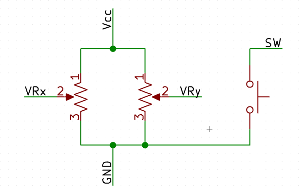
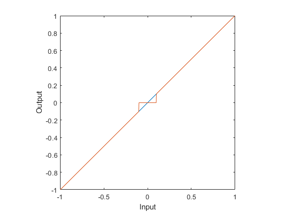
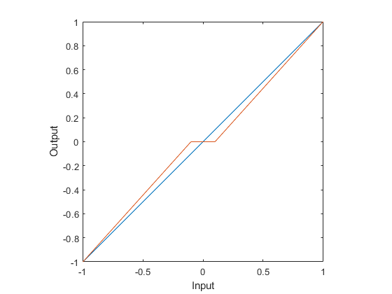
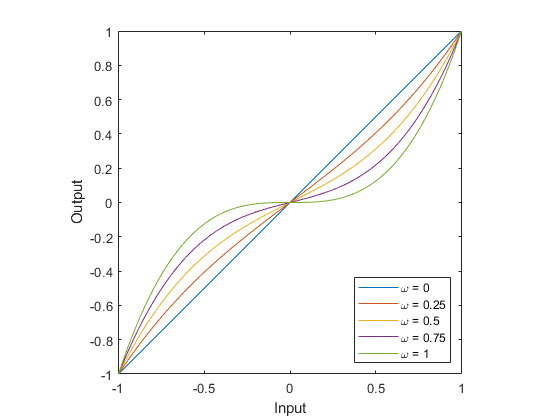
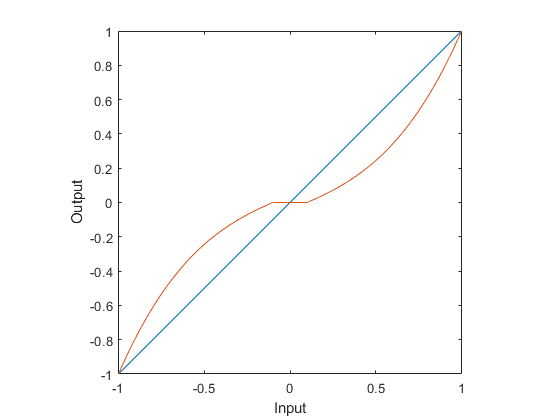

+++
title = "Notes on Joystick Implementation"
date = 2020-11-05T21:59:07-08:00
weight = 15
toc = true
katex = true
+++
<!-- spellcheck: off -->

### Understanding Joystick Output
The output from the joystick is fully analog, using potentiometers to covert the joystick motion into a voltage you can measure. 
The figure below shows the internal circuity of the joystick.

You can then apply the resistor divider equation to get the voltages `VRx` and `VRy`:

$$ V_i = V_\mathrm{CC} \frac{V_\mathrm{sweep}}{V_\mathrm{total}}$$

Notice that this equation is fully linear with respect to the rotation of the joystick.

A digital system cannot directly read an analog voltage, so \\(V_i\\) is measured with an analog-to-digital converter (ADC).
Since this returns a binary number[^unitless] that represents the voltage input to the ADC, we use the idea of "counts" to represent the measured value.

{}
ADCs are typically characterized by how many "bits" they have.  You might hear of, for example, an 8-bit ADC, or a 10-bit ADC, or a 16-bit ADC.  This number refers to the size of the binary number the ADC passes to the processor: an 8-bit ADC would output, say, `0b00101100` or `0b11101011`&mdash;and is capable of all values from \\(0\\) to \\(2^N-1\\). An 8-bit ADC can therefore output 256 unique values, while a 16-bit ADC can output 65536.

These numbers are evenly distributed between two reference points against which the ADC is measuring the signal. Typically, these are ground and the supply rail, but may vary in general.
{}

For a 10-bit ADC, like we have on the PIC, we have that  is `0x00`, and \\(V_\mathrm{CC}\\) is `0x3FF`[^decimal1].

[^unitless]: Since it's a pure number, it has no units, which is also partly why it makes more sense to think of it as "counts".
[^decimal1]: That's 1023 in decimal.  Remember that \\(2^{10}\\) is 1024, but since 0 is a possible value, the 1024th number we can represent is 1023.

This numeric value then has to be converted to a "control" by your code.
Thinking in counts can make your life easier here.

### Control Mappings
Let's now walk through the process of taking the raw ADC measurement and getting a useful control signal out of it.

#### Getting a Control Value
We start be defining a few terms. 
We let the "player" be the thing controlled by the joystick, and we define the player state as the vector \\(\mathbf{s}\\) and the control as \\(\mathbf{u}\\). 
We will also define the raw output of the joystick as \\(\mathbf{j}\\). 
That is,

$$ \mathbf{s} = \begin{bmatrix} x \\\ y \end{bmatrix}, \mathbf{j} = \begin{bmatrix} C_x \\\ C_y \end{bmatrix}, $$

where \\(C_i\\) are the measured values from the ADC in counts, and \\(x\\) and \\(y\\) are the coordinates of the player.

In order to get \\(\mathbf{u}\\) we can perform a linear transformation on \\(\mathbf{j}\\) by multiplication with a scaling matrix \\(\mathbf{M}\\) and adding an offset vector \\(\mathbf{b}\\):

$$ \mathbf{u} = \mathbf{M}\mathbf{j} + \mathbf{b} $$

$$ \mathbf{M} = \begin{bmatrix} m_x & 0 \\\ 0 & m_y \end{bmatrix}, \mathbf{b} = \begin{bmatrix} b_x \\\ b_y \end{bmatrix} $$

This will transform our joystick output to a control through a linear mapping[^affine]. 
Other mappings are possible[^mappings], but linear is the simplest to implement. 
All the above equations can be reduced if only 1 axis of the joystick is used.
Note that \\(\mathbf{M}\\) is a diagonal matrix&mdash;this ensures that we're only scaling each joystick axis independently, and not coupling the axes to each other or rotating them.

[^mappings]: And, in fact, are somewhat common in this type of input processing.  More on this when we talk about usability.
[^affine]: Yes, yes, technically adding \\(\mathbf{b}\\) makes it affine, we know.

Spend time on this! 
Converting your joystick output to a control can make or break your gameplay. 
Tune your controls carefully to get the desired feel when playing. 
Play around with \\(\mathbf{M}\\) and \\(\mathbf{b}\\) to see what works well and what doesn’t&mdash;typically, you'll find it most useful to re-center the input around 0 as part of the processing, as it makes the remaining math much simpler.
If you feel compelled to use a different transformation technique, go for it! 
Also consider stability; you don’t want your player bouncing all over the place either. 

Now that we have a control mapping technique, what control options do we have? There are two main types, position and velocity mapping.

#### Position Mapping
Position mapping is quite intuitive[^intuitive]. 
Wherever the joystick goes, the player goes. 
In mathematical terms:

$$ \mathbf{s}_t = \mathbf{u}_t + \mathbf{s}_0 $$

where \\(\mathbf{s}_t\\) and \\(\mathbf{u}_t\\) represent the state and control vectors at time \\(t\\), and \\(\mathbf{s}_0\\) the initial state.
Essentially, this means that the player will be positioned on the screen wherever the joystick is.
If the joystick is moved to the extreme left, the player goes to the extreme left.
When the joystick snaps back to center, the player snaps back to center as well.
This type of control is not seen often.

[^intuitive]: At least, intuitive to write the code...

#### Velocity Mapping
The more popular control scheme is where the joystick controls the velocity of the player rather than position.
Essentially, the user creates a velocity vector by moving the joystick, and this velocity is then applied to the player, causing the player to move around. 
In mathematical terms:

$$ \mathbf{s}_t = \mathbf{s}_0 + \int_0^t \mathbf{u}_τ \\,\mathrm{d}τ $$

Of course, performing an integral is not possible in a discrete environment, thus we have to use a summation technique. 
Furthermore, we want to use an iterative approach since we cannot get an absolute control as a function of time, thus we convert the integral expression to the following: 

$$ \mathbf{s}_t = \mathbf{s}\_{t-1} + \mathbf{u}_t \Delta t $$

This is an Euler integration approach that is the simplest to implement. 
There are other techniques, such as trapezoidal integration or Simpson's Rule, that you can also experiment with. 
Here we only need to know the previous state. 
Then, using the control and time between the current and last measurement, we can calculate what the state should be at the current time.

The keen reader will note that we have not specified any stability criterion, as Euler really only works for the correct \\(\Delta t\\). 
While this is true when trying to converge to a solution, in our usage, we do not worry about convergence since we are not trying to reach a specific solution. 
Since the user will be playing the game, they will correct for their motions inherently. 
The only caveat is to ensure \\(\Delta t\\) is small enough to make the motion appear smooth to the user.  

### Usability

If you've tried experimenting with the \\(\mathbf{M}\\) and \\(\mathbf{b}\\) matrices, and you still can't find a control mapping you're happy with, you may want to look at some more advanced mappings to help usability.
When you're trying to control things with a velocity-mapped controller, it's typically the case that
1. When you're near zero, you want to remain still, even if your hand is jittering a little, or is busy moving the other joystick axis.
2. When you're near zero, you want more precise control over small velocities.

These can be addressed by applying deadbands and cubic mappings.
Pretty much every analog input you use in your life&mdash;computer mice, some volume knobs, joysticks on your gaming console&mdash;will typically do one or more of these to make the inputs feel smoother and more intuitive.
Sometimes these will do even more complicated mappings, like adding acceleration based on the time you hold a particular velocity, or by modifying the mapping function based on the speed of the input.
These are outside the scope of this note, but simply to point out that when mapping controls, the sky's the limit[^sky].

[^sky]: Pun somewhat intended. Modern aircraft have many flight modes, where the control stick input is mapped in a way that incorporates the aircraft dynamics, so that moving the stick isn't interpreted as a command to move a control surface a certain amount, but as a command to have the entire aircraft move in a particular way.

#### Deadband

The simplest way to damp out micromotions near zero (when the user wants to be still) is to simply ignore any value with small absolute value:

$$ d(x) = \begin{cases} 0 & |x| \lt \delta  \\\ x & |x| \geq \delta \end{cases} $$

where \\(\delta\\) is half the total width of the deadband.
This ends up looking like this:

Notice that while small inputs near zero don't accidentally move the player, the user also can't make very small movements.
The output suddenly jumps from 0 to a value when leaving the deadband, so the user can never command values smaller than this.

#### Scaled Deadband

To fix this, we can scale the function outside the deadband so it smoothly goes to the same value at the ends from zero:

$$ g(x) = \begin{cases} 0 & |x| \lt \delta  \\\ \frac{f(x) - \text{sign}\\,x \cdot f(\delta)}{\max_x f(x) - f(\delta)} & |x| \geq \delta \end{cases} $$

where again \\(\delta\\) is half of the total deadband width, \\(x\\) is the input, and \\(f(x)\\) is a continuous odd function.
Setting \\(f(x)=x\\) gives us a scaled linear deadband, like so:

Now when the deadband ends, the user can still apply arbitrarily small inputs if they choose to, so that's an improvement.

#### Cubic Scaling
However, this still sacrifices smoothness and precision near zero; using a cubic scaling can help with balancing range and precision.
We define \\(c(x)\\) as follows:

$$ c(x) = \omega x^3 + (1-\omega)x $$
where \\(\omega \in [0,1]\\) can be thought of as a blending factor, mixing linear and cubic responses; for \\(\omega=0\\), we have \\(c(x)=x\\) and get a straight mapping of input to output.  As \\(\omega\\) is increased, the function approaches \\(x^3\\), reducing sensitivity near zero:

#### Scaled Cubic Deadband

But now we've lost the deadband. However, it so happens that this particular function is, in fact, a continuous odd function, so we can just plug it back into \\(g(x)\\) in place of \\(f(x)\\), giving us a scaled cubic deadband:

This gives you a lot more flexibility in how exactly you choose to map your inputs to your outputs.
This may not even be something you want in all cases, so don't feel like this is the only answer.  The only right answer is the one that makes your game fun and enjoyable to play.

----
Contributed by Riyaz Merchant and Arul Suresh, 6 Nov 2020.