+++
title = "Magnetic Field Sensing"
date = 2020-01-09T21:59:07-08:00
weight = 5
toc = true
katex = true
+++

If this looks overly mathematical, don’t worry, you can certainly skip the math and get something working by trial and error as is commonly done. If you take this approach, you still might want to check out the section on matching your coil resonance to the track frequency to minimize noise picked up from other sources. Either way, it’s usually helpful to understand the underlying physics when it comes to troubleshooting or improving your sensors. Also, some quick, back of the envelope calculations can often get you in the ballpark a lot quicker than random experimentation.

### Basic E&M

A current flowing in an infinite wire will generate a magnetic field that circles around  the wire (in a direction given by the right hand rule – align your thumb with the current, and your fingers point in the \\(B\\) field direction) whose strength drops off with \\(1/r\\):

$$B=\frac{\mu_0 i}{2\pi r}$$

where \\(\mu_0 = 1.26 \times 10^{-6} \mathrm{H}/\mathrm{m}\\) is the vacuum permeability, \\(i\\) is the current in Amps, and \\(r\\) is the distance from the wire in meters.

So if there is a sinusoidal current flowing in the wire that looks like

$$ \begin{aligned} i &= 0.1 \sin \omega t \\\ \omega &= 2\pi f \\\ f &= 20000 \end{aligned} $$

It will generate a magnetic field around the wire that varies sinusoidally in time:

$$ B = \frac{\mu_0}{2\pi r} \cdot 0.1 \sin \omega t $$

### Detection

An easy way to detect a magnetic field is to take advantage of the fact that when the magnetic flux in a loop of wire changes, a voltage is generated in the coil that is proportional to the rate of change:

$$ \begin{aligned} V &= -\frac{\partial\Phi}{\partial t} \\\ \Phi &= B \cdot A\end{aligned} $$

where \\(B\\) is the magnetic field, and \\(A\\) is the coil area. We assume that \\(B\\) is constant over the area of the coil, which is a good approximation when the coils are small.

Calculating the peak induced voltage for a  diameter coil located  from the wire, we get:

$$ \begin{aligned} V &= -\frac{\partial}{\partial t} \left( \frac{\mu_0}{2\pi r} \cdot 0.1 \sin \omega t \right) \cdot A \\\ &= \omega \cdot \left( \frac{\mu_0}{2\pi r} \cdot 0.1 \cos \omega t \right) \cdot A \\\ V_\mathrm{peak} &= 2.52 \thinspace \mathrm{\mu V} \end{aligned} $$
<!-- need to figure out upright mu here -->
which is a miniscule value, and would not be able to see it on a typical oscilloscope with  resolution. To increase your signal, you can connect several of these sensor loops in series. If you have \\(N\\) turns on your coil, you will get an induced voltage that is \\(N\\) times larger than the result for a single loop. With 1000 coils on the same sensor as above, you would see , which is something you can work with. This still needs amplification, but a relatively simple op-amp circuit will do.

So at some fixed distance from the wire, there are two things you can do to increase your signal&mdash;increase coil area or number of turns:

$$ V \propto N \cdot A $$

### Coils as Inductors

Any time you have a coil, you also have an inductor. For a coil with length much greater than diameter, the inductance is:

$$ L = \frac{\mu_0 A N^2}{l} $$

where \\(A\\) is the coil area, \\(N\\) the number of turns, and \\(l\\) the length of the coil.

For a practical coil that may have a length similar in magnitude to the diameter, this is only an approximation good to within a factor of 2 or so. To increase the inductance, inductors are often wound around core materials. These cores effectively amplify the magnetic field (and therefore inductance), by anywhere from factors of 10s to 1000s. Iron is commonly used at low frequencies, and ferrite is used at higher frequencies.[^ferrite]

[^ferrite]: Ferrite has much lower losses at high freqencies since it is an electrical insulator and doesn’t let internal dissipative eddy currents flow as iron does.

Also, real inductors always have some capacitance, resulting from the numerous turns of wire wound next to one another. There is always capacitance between two neighboring wires, increasing with decreasing separation.[^capacitance] This capacitance can easily be on the order of 10s to 100s of pF for a peanut-sized coil.

[^capacitance]: For two wires with radius \\(r\\) and separation \\(s\\), the capacitance is \\(C=\pi\epsilon/\log\left(s/r\right)\\)where \\(\epsilon\\) is the permittivity of the insulator, typically 2-6 times \\(\epsilon_0\\), the permittivity of free space.

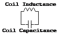

You might think, 'who cares about picoFarads anyways'&mdash;that is, until you see a mysterious high frequency ringing on a coil that you thought was an ideal inductor. You may be able to see this with sensors that are not designed to resonate at the track frequency (as described below) but resonate at some other frequency (ie: the “self-resonant” frequency that depends on coil capacitance & inductance). A simple model of what this can look like can be generated in circuitmaker:

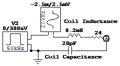

The sinusoidal source is simulating the signal from the track, the lower magnitude square wave source is simulating quick noise pulses that might be generated from motor switching, etc. The resulting waveforms show hi-frequency ringing at the self-resonant frequency (triggered by the noise spikes) riding on top of the desired  signal waveform:

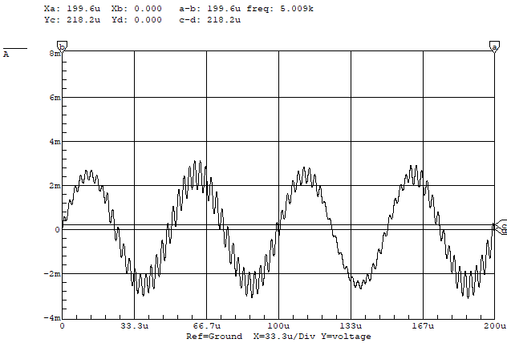

### LC Resonance and Signal Amplification

You can make a functional sensor using a coil as described above, although it may need to be pretty big (large area, lots of turns) in order to give you a signal large enough to work with. By adding a capacitor in parallel with your coil (and effectively in parallel with the internal coil capacitance), you can make a circuit that resonates at the track frequency. The frequency of this resonance is given by: 

$$ f = \frac{1}{2\pi\sqrt{LC}} $$

The effect of this is that a small signal from the track can drive a much larger oscillation in the parallel inductor capacitor circuit, which is easier to detect. The effective amplification of a circuit like this can easily be on the order of 10-100. You can model the induced voltage in the coil as a sinusoidal voltage source in series with the inductor:[^inductorModel]

[^inductorModel]:  In this model, you have access to the outer leads of the sinusoidal source and inductor in your real-world inductor, but not the one connecting the two.

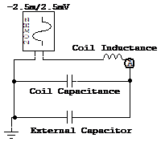

If you could build this circuit and then swept the frequency knob on the function generator, you’d get a plot of \\(V_\mathrm{in}/V_\mathrm{out}\\) vs. frequency that looks like:

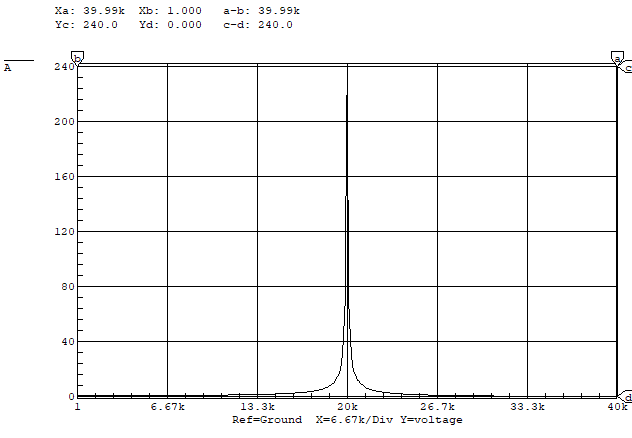

If you actually used ideal components[^idealJoke] and turned the knob very slowly, you’d find that the peak at  was infinite.

[^idealJoke]: Available in the TA office for a slight premium.

This measure of the sharpness of resonance is called the quality factor, or Q, of the circuit. For this circuit, it is infinite. Q is defined as the resonant frequency divided by the width in frequency units of the curve at the point where it is \\(1/\sqrt{2}=0.707\\) times the maximum value.[^divZeroJoke]

[^divZeroJoke]: That is, \\(\infty/0\\) for this curve, which as we all know is "a suffusion of yellow" in your calculator.

Suppose all the ideal inductors are used up and you have to order a real inductor from Digi-Key. You find that it has  of resistance due to the many turns of thin wire. You plug this into your circuitmaker model:

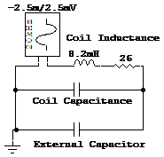

and get this response:

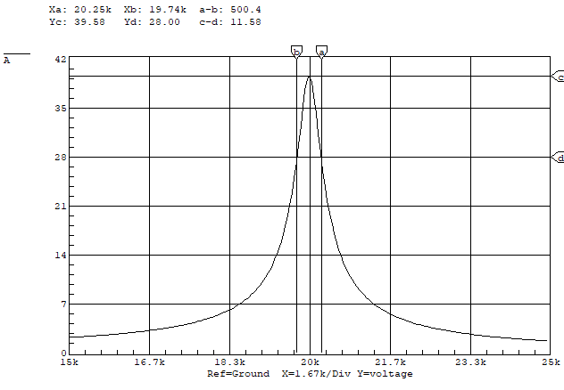

Now instead of having an infinite peak, the resonant circuit amplifies the field signal by about 40. Since the peak is no longer infinite, you happily calculate Q to be 40. Another handy Q formula for a series resistor like this is:

$$ Q = \frac{2\pi\omega_\mathrm{res} L}{R} $$

Now, suppose Mark Merlo was playing with the function generator and tweaked the frequency knob so it’s generating  instead of . Now the gain of the resonant circuit goes from 40 down to 9, just after you spent hours calibrating your code to work with a gain of 40. So that’s problem #1: your circuit is sensitive to small changes in track frequency. Eventually, Sara figures out what the deal is and recalibrates the knob to . Luis is just starting to build his circuit but Brandon stole all of his capacitors to extend the range of the electric banana. Fortunately, he manages to find a pair with the exact value he needs in the cabinet of freedom, and they even have a &#177; tolerance (good as far as capacitors go). Suppose one of the caps is dead on the labeled value, and the other is  high, so that circuit will have a resonant frequency of . Now the gain will be approximately 17 for that sensor and 40 for the other sensor&mdash;not a very well matched pair of sensors.

These undesirable effects of a sharp resonance peak can mitigated by lowering the Q even more, which flattens out the peak. An easy way to do this is with a parallel resistor:

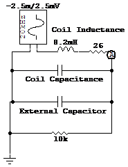

If you only have a parallel capacitor (in the location of the  resistor) and replace the  capacitor with a wire, the Q is given by:[^error]

[^error]: Currently just copied, and this sentence clearly got jumbled at some point.

$$ Q = 2\pi f_\mathrm{res} RC $$

where \\(C\\) is the total capacitance summing the coil and external capacitances.

If you have both resistors in the circuit, the resultant Q is well approximated by
$$ \frac{1}{Q_\mathrm{total}} = \frac{1}{Q_\mathrm{R,series}} + \frac{1}{Q_\mathrm{R,parallel}} $$

This expression may even be exact, who knows?  Anyways, the peak is quite a bit flatter now so that if the frequency shifts by  to , the signal only changes by , which is a lot better than the factor of 4 we saw above.

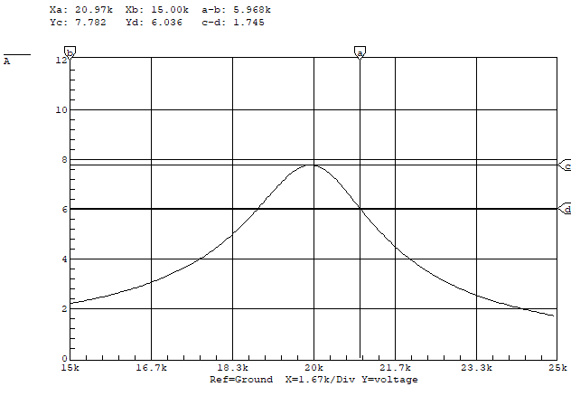

This parallel resistor that lowers the Q of the circuit is sometimes called a Q-killer resistor for obvious reasons. You’ll want to pick a Q-killer resistor that gives you good amplification without too sharp of a resonant peak which would result in sensitivity to slight frequency variations.

### Noise Rejection

If there is EM noise at frequencies other than the track frequency,[^noise] it will also generate a signal in your sensors. Suppose you have a coil without a resonant capacitor, and the rate of change of magnetic flux from the switched motor current is the same as the rate of change of magnetic flux due to the wire under the track, in the location of your sensor. Then an equal voltage will be produced in the sensor, which will show up as noise that is just as large as your signal.
If your sensor is part of a tuned circuit that amplifies the track frequency by a factor of 10, then the induced noise from the motor will be 1/10 of the track signal, which is a good thing. 

[^noise]: For example, from the switching of motor currents.

There are a few things you can do to minimize magnetic noise generated by the motor.

1. Don’t put your sensors right next to your motors.

1. Run the current supply and return wires for a motor close together. If you run them in a big open loop (and maybe wrap them around your sensors a few times), they will generate much larger magnetic fields & hence more sensor noise.

1.  Don’t switch motor currents faster than you need to. For the LMD18200’s, this means leaving off the bootstrap capacitors (which (when added) cause the MOSFETs in the H-bridge to turn on and off a lot faster).  When you turn off a MOSFET real fast, the current through it and all the associated wiring changes real fast (large di/dt).  This causes any associated magnetic fields to change real fast (which is what your sensors detect), and also causes voltage drops across the wires that were supplying the current due to the inductance of these supply wires.

{}
Decreasing switching speed is entirely different from decreasing PWM frequency&mdash;lowering the PWM frequency will not affect the switching speed. The MOSFETs still switch on/off at the same speed, they just switch less often at a lower PWM frequency.
{}

### Signal Amplification

After all this work (actually, its not that bad, just a few components soldered in parallel), you’ll still probably want to amplify your signal. One feature of the resonant circuits described above is that they do not have very high output impedance&mdash;that is, if you try drawing significant currents from them it will load them down and kill the resonance. Kind of like sticking a tuning fork in a block of cheese&mdash;the fork will not continue to shake the cheese at 1&thinsp;kHz for minutes. Instead, the vibrations will quickly die down to nothing.

Two ways to deal with this low-impedance sensor are to buffer the signal or simply use a non-inverting op-amp configuation (as shown below):

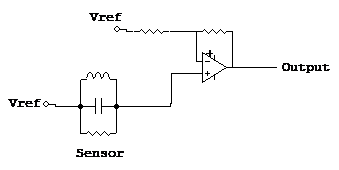

As long as the op amp doesn’t saturate (output goes to one rail or the other), this will work pretty well. The LM6144s have the ''interesting'' property that if an output saturates and the inputs are no longer held at the same voltage (no longer ideal ), then the input impedance drops drastically, which can load the sensor down and kill the resonance. This can make for some frustrating debugging sessions until you figure out what’s happening.

Once you’ve amplified the signal, you can either build a peak detector circuit or do the peak detection in software. Given the amount of other stuff going on in software, the peak detector circuit is not a bad choice. Choose your R & C carefully to give the best compromise between smooth signal and fast response to signal changes:

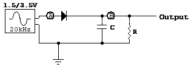

Time constant, \\(\tau=RC\\), too small (excessive ripple):

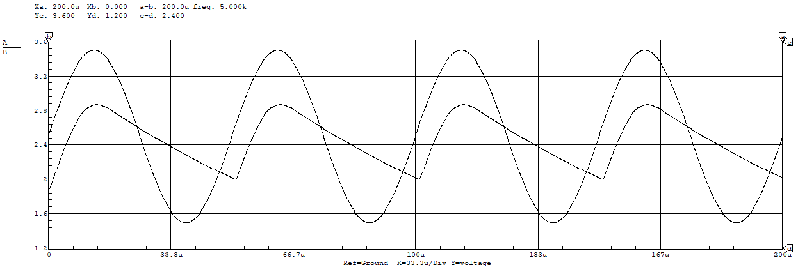

Time constant, \\(\tau=RC\\), too large (output doesn't track input):

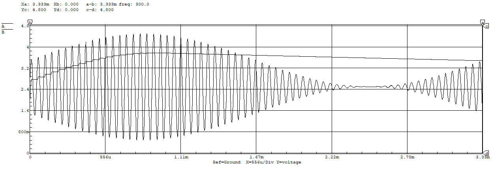

### Sensor Locations & Sensor Signal Math

Once you’ve got your sensors working, where do you put them and what do you do with them? First of all, there are three basic sensor orientations. We’ll call these the Horizontal, Vertical, and Parallel (referring to the axis of the coil). When your sensor axis is parallel with the wire, the field is all perpendicular to the coil, so there is no field component going through the coil, and you get no signal. So, you can forget about those. Vertical and Horizontal coils are more useful.

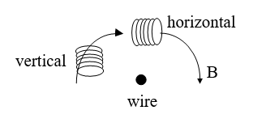

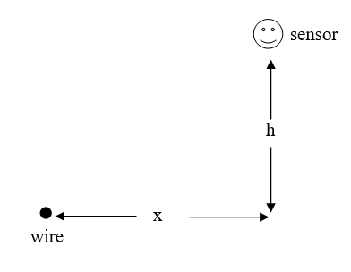

For a coil that is located a horizontal distance \\(x\\) from the wire and a height \\(h\\) above the wire, the magnitude of the component of the field that is actually passing through the coil (aligned with the coil axis) is given by:

$$ \begin{aligned} B_\mathrm{h} &= \frac{\mu_0 i h}{2\pi\left(x^2+h^2\right)} \quad \mathrm{horizontal\space{}coil} \\\ B_\mathrm{v} &= \frac{\mu_0 i x}{2\pi\left(x^2+h^2\right)} \quad \mathrm{vertical\space{}coil} \end{aligned} $$

For a horizontal sensor at fixed height \\(h_0\\), if you plot the normalized signal in the sensor over a range of \\(x\\) values that span \\(\pm3h_0\\) you will get something looking like:

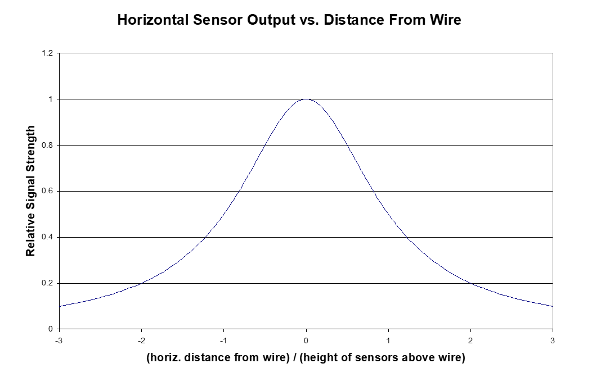

Suppose you have two sensors, each mounted a distance \\(h_0\\) from the center of the robot. Assume horizontal distance \\(x\\) increases positively to the right of the wire. For a sensor mounted at \\(x =  +h_0\\), the sensor will be over the wire when the center of the robot is at \\(x =  -h_0\\), so plotting the right sensor signal as a function of the position of the robot center gives us something like:

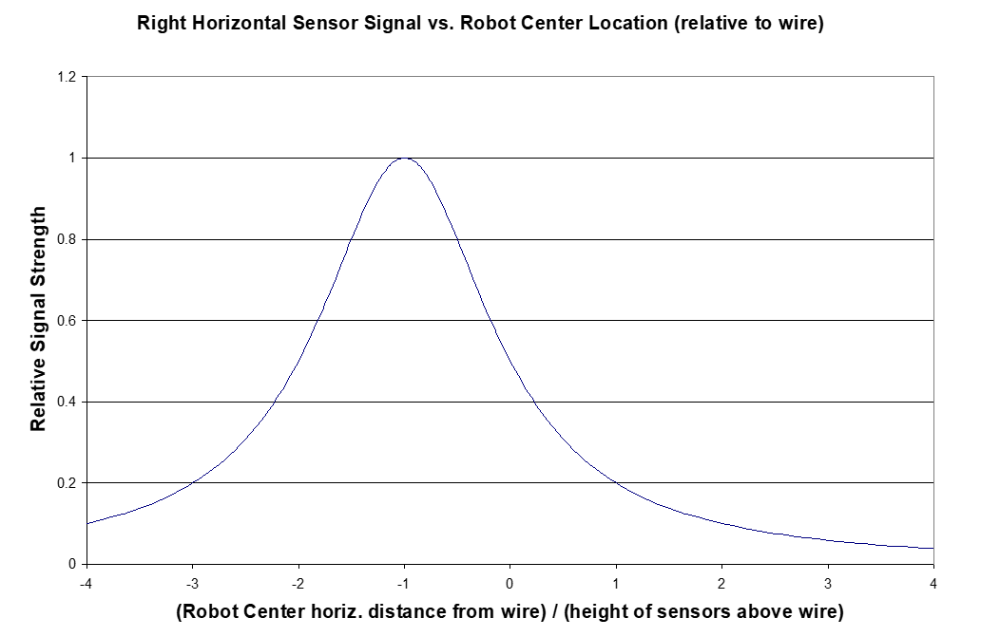

The left sensor signal is found in exactly the same way, and its peak will occur when the center of the robot is at  \\(x =  +h_0\\). If you read these signals into the HC12 and subtract them in software (Left Sensor – Right Sensor), you get a signal which is roughly proportional to the deviation of the robot center from the wire, over a limited range centered about a deviation of 0.

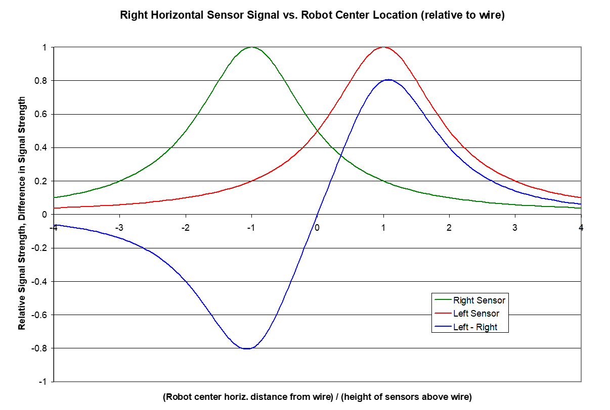

{}
If you use the summed signal for feedback control, be aware that if the wire is not between the sensors, the sense of the signal can invert.  For example, going from \\(x=-1\\) to \\(x=0\\), the value of the summed signal is increasing.  However, this is also true when going from \\(x=-2\\) to \\(x=-3\\)&mdash;away from the wire.  Keep this in mind when deciding how your robot will respond.
{}

You can follow the exact same procedure to make plots of vertically mounted sensors, or different horizontal sensor configurations (heights, spacing). Similarly, by manipulating your sensor signals with simple math, you may find some resultant signal that works better for whatever you want to do with the position information.

### Other Sensing Tidbits

1. If your sensors are mounted near any conductive materials (aluminum and copper in particular), induced currents will flow in the metals that partially cancel out the fields that you are trying to measure. So mounting your sensors on aluminum rails probably would not be a good idea.

2. You’ll have to have a fairly accurate capacitance to set the resonant frequency where you want it.  There are  and  tolerance polyester caps for sale with the coil/inductors. Two advantages of these caps over ceramic caps is tolerance ( is typical on ceramic) and low capacitance change with change in temperature (not sure what the specs are but these type of capacitors typically change an order of magnitude less than ceramic caps for a given change in temperature). 

3. If you’re trying to dial in your total capacitance by adding small parallel capacitors, the tolerances on these smaller caps are much less important than the tolerances on the larger caps that make up the bulk of the capacitance. For example, if a parallel cap provides the final  of capacitance with a  capacitance tolerance, it will only contribute about  to the overall tolerance range.

----
Contributed by Oliver Max, 20 Feb 2002.

Adapted for web by Arul Suresh, 11 January 2020.