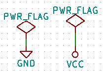

## Eeschema
EEschema is KiCad's schematic capture and annotation tool; this is where you'll be drawing your schematics by placing components and hooking them up.
If you haven't already, start or open a project to hold the schematic.

Before stepping through this tutorial, download the `teensy.lib` symbol library from https://github.com/XenGi/teensy_library.

### Some useful shortcuts
The keyboard shortcuts you'll be using most frequently for schematics are:
- <kbd>a</kbd> - add a component.
- <kbd>c</kbd> - copy a component.
- <kbd>w</kbd> - wire components together.
- <kbd>e</kbd> - edit a component.
- <kbd>v</kbd> - edit component value.
- <kbd>Esc</kbd> - escape any command in progress.
- <kbd>Ctrl</kbd>+<kbd>z</kbd> - undo.
- <kbd>Ctrl</kbd>+<kbd>s</kbd> - save.

### Creating a Schematic

1. Let’s begin by creating a schematic. Start the schematic editor Eeschema, . It is the first button from the left.

1. Click on the 'Page Settings' icon  on the top toolbar. Set the appropriate paper size ('A4', '8.5x11', etc.) and enter the Title as 'Tutorial'. You will see that more information can be entered here if necessary. Click OK. This information will populate the schematic sheet at the bottom right corner. Use the mouse wheel to zoom in. Save the whole schematic: **FileSave**

1. We will now place our first component. Click on the 'Place symbol' icon  in the right toolbar. You may also press the 'Add Symbol' hotkey <kbd>a</kbd>.

1. Click on the middle of your schematic sheet. A *Choose Symbol* window will appear on the screen. Note that several thousand schematic symbols may be loaded, so make frequent use of search.  
We’re going to place a resistor. Search / filter on the 'R' of Resistor. You may notice the 'Device' heading above the Resistor. This 'Device' heading is the name of the library where the component is located, which is quite a generic and useful library.

{} 
Once you use a symbol, it will be listed at the top with other recently used symbols, making filling in passives easier. 
{}
 

 
5. Double click on it. This will close the *Choose Symbol* window. Place the component in the schematic sheet by clicking where you want it to be.

1. Try to hover the mouse over the component 'R' and press <kbd>r</kbd>. The component should rotate. You do not need to actually click on the component to rotate it.

{}
Sometimes, if your mouse is also over something else, a menu will appear. You will see the *Clarify Selection* menu often in KiCad; it allows working on objects that are on top of each other. In this case, tell KiCad you want to perform the action on the 'Symbol …​R…​' if the menu appears.
{}

7. Right click in the middle of the component and select **PropertiesEdit Value**. You can achieve the same result by hovering over the component and pressing <kbd>v</kbd>. Alternatively, <kbd>e</kbd> will take you to the more general Properties window. Notice how the right-click menu below shows the hotkeys for all available actions.

8. The Edit Value Field window will appear. Replace the current value 'R' with '1k'. Click OK

{}
Do not change the Reference field (R?), this will be done automatically later on. The value above the resistor should now be '1k'.
{}

9. To place another resistor, simply click where you want the resistor to appear. The symbol selection window will appear again.

1. The resistor you previously chose is now in your history list, appearing as 'R'. Click OK and place the component.

1. In case you make a mistake and want to delete a component, right click on the component and click 'Delete'. This will remove the component from the schematic. Alternatively, you can hover over the component you want to delete and press <kbd>Del</kbd>.

1. You can also duplicate a component already on your schematic sheet by hovering over it and pressing <kbd>c</kbd>. Click where you want to place the new duplicated component.

1. Right click on the second resistor. Select 'Drag'. Reposition the component and left click to drop. The same functionality can be achieved by hovering over the component and by pressing <kbd>g</kbd>. <kbd>r</kbd> will rotate the component while <kbd>x</kbd> and <kbd>y</kbd> will flip it about its x- or y-axis.

{}
**Right-ClickMove** or <kbd>m</kbd> is also a valuable option for moving anything around, but it is better to use this only for component labels and components yet to be connected.
This is because Drag keeps wire connections to the component attached while moving, while Move simply moves the components, leaving the wires behind.  Both can be useful, but Drag is more often what you want.
{}

14. Edit the second resistor by hovering over it and pressing <kbd>v</kbd>. Replace 'R' with '100'. You can undo any of your editing actions with <kbd>Ctrl</kbd>+<kbd>Z</kbd>.

1. Change the grid size. You have probably noticed that on the schematic sheet all components are snapped onto a large pitch grid. You can easily change the size of the grid by **Right-ClickGrid**. 

{}
In general, it is recommended to use a grid of 50.0 mils for the schematic sheet.
{}

16. We are going to add a Teensy to our circuit, which does not have a symbol natively in KiCad. Copy `teensy.lib` into the KiCad project folder. In the Eeschema menu, choose **PreferencesManage Symbol Libraries**. In the Symbol Libraries window you can see two tabs: Global Libraries and Project Specific Libraries. Each one has one sym-lib-table file. For a library (.lib file) to be available it must be in one of those sym-lib-table files. If you have a library file in your file system and it’s not yet available, you can add it to either one of the sym-lib-table files. We will now add the Teensy library.

1. Select the Project Specific table. Click the *Browse Libraries...* button below the table. Since you placed the library in the project folder, you should be able to choose and add the `teensy.lib` library and close the window. It will be added to the end of of the list. If you wish you can click its nickname and change it, but 'teensy' is fine for now. Close the Symbol Libraries window with OK.

1. Repeat the add-component steps, however this time select the 'teensy' library instead of the 'Device' library and pick the 'Teensy-LC' component.

1. Hover the mouse over the microcontroller component. Notice that <kbd>x</kbd> and <kbd>y</kbd> again flip the component. Keep the symbol mirrored around the Y axis so that pins 5 and 6 (`3_RX1_PWM_Touch` and `4_TX1_PWM_Touch`) point to the right.

1. Repeat the add-component steps, this time choosing the 'Device' library and picking the 'LED' component from it.

1. Add another component, this time `Conn_01x03_Male`.  This is a generic 3-pin connector.

1. Organise all components on your schematic sheet as shown below.

23. The component identifier 'J?' will appear above the `Conn_01x03_Male` label. If you want to change its position, right click on 'J?' and click on 'Move Field' (equivalent to <kbd>m</kbd>). It might be helpful to zoom in before/while doing this. Reposition 'J?' under the component as shown below. Labels can be moved around as many times as you please.

24. It is time to place the power and ground symbols. Click on the 'Place power port' button  on the right toolbar. Alternatively, press <kbd>p</kbd>. In the component selection window, scroll down and select 'VCC' from the 'power' library. Click OK.

1. Click above the pin of the  resistor to place the VCC part. Click on the area above and to the left of the Teensy. In the 'Component Selection history' section select 'VCC' and place another to the left of the microcontroller. Repeat the add process again and place a VCC part above pin 1 of the connector. Move references and values out of the way if needed.

1. Repeat the add power symbol steps but this time select the GND part. Place a GND part under pin 3 of the connector. Place another GND symbol below and to the left of the microcontroller. Your schematic should now look something like this:

27. Next, we will wire all our components. Click on the 'Place wire' icon  on the right toolbar.

{}
Be careful not to pick 'Place bus', which appears directly beneath this button but has thicker lines and is blue. For more on how to use bus connections refer to the full [KiCad Documentation](https://docs.kicad-pcb.org/5.1.5/en/getting_started_in_kicad/getting_started_in_kicad.html#bus-connections-in-kicad).
{}

28. Click on the little circle at the end of pin 5 of the microcontroller and then click on the little circle on pin 1 of the LED. Click once when you are drawing the wire to create a corner. You can zoom in while you are placing the connection.

{}
If you want to reposition wired components, it is important to use <kbd>g</kbd> (to grab) and not <kbd>m</kbd> (to move). Using grab will keep the wires connected.
{}

29. Repeat this process and wire up all the other components as shown below. To terminate a wire just double-click. When wiring up the VCC and GND symbols, the wire should touch the bottom of the VCC symbol and the middle top of the GND symbol. See the screenshot below.

30. We will now consider an alternative way of making a connection using labels. Pick a net labelling tool by clicking on the 'Place net label' icon  on the right toolbar. You can also use <kbd>l</kbd>.

1. Click the wire connected to the resistor which we connected to pin 6 of the microcontroller. Name this label 'INPUT'. The label is still an independent item which you can for example move, rotate and delete. The small anchor rectangle of the label must be exactly on a wire or a pin for the label to take effect.

1. Follow the same procedure and place another label on the wire to pin 2 of the connector. Also name it 'INPUT'. The two labels, having the same name, create an invisible connection between pin 2 of the connector and the  resistor. This is a useful technique when connecting wires in a complex design where drawing the lines would make the whole schematic messier. To place a label you do not necessarily need a wire, you can simply attach the label to a pin.

1. Labels can also be used to simply label wires for informative purposes. Place a label on pin 5 of the Teensy. Enter the name 'uCtoLED'. Name the wire between the resistor and the LED as 'LEDtoR'.

1. You do not have to label the VCC and GND lines because the labels are implied from the power objects they are connected to.

1. Below you can see what the final result should look like.

36. Sometimes it is good to write comments here and there. To add comments on the schematic use the 'Place text' icon  on the right toolbar.

1. All components now need to have unique identifiers, so let's rename all of those components still named 'R?' or 'J?'. Identifier assignation can be done automatically by clicking on the 'Annotate schematic symbols' icon ~[annotate symbols icon](annotate.png?classes=inline) on the top toolbar.

1. In the Annotate Schematic window, select 'Use the entire schematic' and click on the 'Annotate' button. Click 'Close'. Notice how all the '?' have been replaced with numbers. Each identifier is now unique. In our example, they have been named 'R1', 'R2', 'U1', 'D1' and 'J1'.

1. If you're just capturing the schematic for documentation purposes, this schematic is now finished.  Hit <kbd>Ctrl</kbd>+<kbd>s</kbd> to save, and you're done!  If you want a PDF version, either select 'Print' and print to a pdf printer, or select 'Plot' and set the output format to PDF.

### Additional steps to run ERC
KiCad can also run an electrical rules check (ERC) to catch obvious mistakes; to do this, we need to make some more annotations to tell KiCad what we're doing.

1. First deal with unconnected wires. Any pin or wire that is not connected will generate a warning when checked by KiCad. To avoid these warnings you can either instruct the program that the unconnected wires are deliberate or manually flag each unconnected wire or pin as unconnected.

1. Click on the 'Place no connection flag' icon  on the right toolbar. Click on the unconnected pins. An X will appear to signify that the lack of a wire connection is intentional.

1. It is now necessary to add a 'Power Flag' to indicate to KiCad that power comes in from somewhere. Press <kbd>a</kbd> and search for 'PWR_FLAG' which is in 'power' library. Place two of them. Connect them to a GND pin and to VCC as shown below.

4. We can now check our schematic for errors. Click on the 'Perform electrical rules check' icon  on the top toolbar. Click on the 'Run' button. A report informing you of any errors or warnings such as disconnected wires is generated. You should have 0 Errors and 0 Warnings. In case of errors or warnings, a small green arrow will appear on the schematic in the position where the error or the warning is located. Check 'Create ERC file report' and press the 'Run' button again to receive more information about the errors.

