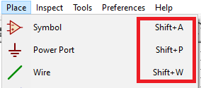
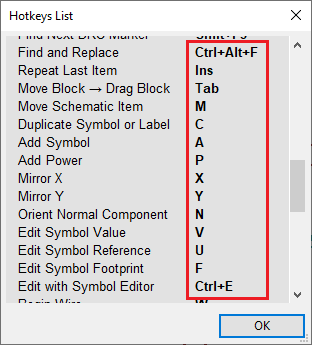

<!-- spellcheck: off -->

KiCad is pretty powerful, and as with many open-source software, can sometimes have a steep learning curve.
For the purposes of use in lab, the rest of this tutorial will focus on things you might use reasonably often.
The detailed information can always be found in the [KiCad documentation](docs.kicad-pcb.org).

That being said, your life will be enormously easier if you get used to some of the keyboard shortcuts for navigation.

## Shortcut keys
KiCad has two kinds of related but different shortcut keys: accelerator keys and hotkeys. Both are used to speed up working in KiCad by using the keyboard instead of the mouse to change commands.

### Accelerator keys
Accelerator keys have the same effect as clicking on a menu or toolbar icon: the command will be entered but nothing will happen until the left mouse button is clicked. Use an accelerator key when you want to enter a command mode but do not want any immediate action.

Accelerator keys are shown on the right side of all menu panes:

### Hotkeys
A hotkey is equal to an accelerator key plus a left mouse click. Using a hotkey starts the command immediately at the current cursor location. Use a hotkey to quickly change commands without interrupting your workflow.

To view hotkeys within any KiCad tool go to **HelpList Hotkeys** or press <kbd>Ctrl</kbd>+<kbd>F1</kbd>:

You can edit the assignment of hotkeys, and import or export them, from the **PreferencesHotkeys** Options menu.

{}
In this document, keypresses are expressed with styling like this: <kbd>a</kbd>. If you see <kbd>a</kbd>, just type the "a" key on the keyboard.
{}

### Example
Consider the simple example of adding a wire in a schematic.

To use an accelerator key, press <kbd>Shift</kbd>+<kbd>w</kbd> to invoke the "Add wire" command (note the cursor will change). Next, left click on the desired wire start location to begin drawing the wire.

With a hotkey, simply press <kbd>w</kbd> and the wire will immediately start from the current cursor location.

## Getting Around 
By default, the mouse wheel zooms in and out.
Holding <kbd>Shift</kbd> while scrolling will scroll the page up and down, while holding <kbd>Ctrl</kbd> will scroll left and right.
Panning can also be done by holding down the middle mouse button (wheel) and dragging.

## Starting a New Project
Each project in KiCad needs a dedicated directory, and has a `*.pro` file defining the project.
To create a project, go to the KiCad man window, then select **FileNewProject...** or simply press <kbd>Ctrl</kbd>+<kbd>N</kbd>.
When making the project, leave the checkbox to create a new directory ticked unless you already have a dedicated directory.