<!-- spellcheck: off -->

## Why Onshape?
[Onshape](https://www.onshape.com/) is a full-cloud parametric CAD system that runs in your browser. This means that your document is stored in the cloud, and if you're working on a group project, everyone edits a single copy of the document, real-time. No more sending one person off to do all the CAD or dealing with whether "Version 1 Final Actual Final" or "Final Version 1" is the more recent copy.

Also, since a lot of CAD in the SPDL context is laser-cut assemblies, Onshape's scripting functionality allows for custom features that make CAD for laser-cut assemblies a snap.

Onshape currently offers all professional features except release management for free with a .edu email address.

## Getting Set Up
First, [sign up for an educational account](https://www.onshape.com/edu) using your Stanford .edu email address. Note that as of Fall 2019, the education subscription expires after 365 days, at which point all your Education-tagged documents become read-only. You can sign up again using the same form to add another year of the Education plan as long as you continue being a student.

If you're used to Solidworks, Inventor, or some other CAD software, you can change Onshape's input preferences to match what you're used to. Once logged in, go to your [account preferences page](https://cad.onshape.com/user/settings), and under "View manipulation" choose the option for the software you're most familiar with.

Onshape has an [Introduction to CAD](https://www.onshape.com/learn/learn-cad) as well as [more in-depth courses](https://learn.onshape.com/) on CAD and data management to help you get up to speed on using the software.

If you're going to be making a lot of laser-cut parts, you'll want to add the set of custom features I wrote to help do that:

[Laser Joint](https://cad.onshape.com/documents/578830e4e4b0e65410f9c34e/w/d04a088a0a8ab8361a2aa65c/e/7af109b2f1cead90850525ae)
: Computes and generates finger joints between intersecting plates.

[T-Slot Joint](https://cad.onshape.com/documents/5791a167e4b03c2aa6af3b35/w/8528f1c2d733302d4632f38e/e/acc455ae2adcf11a571ba510)
: Creates bolted edge connections between plates.

[Kerf Compensation](https://cad.onshape.com/documents/57df36a88f63301089e8ac78/w/d336a806a8a6f0460f7bd440/e/157268905828b0fc910e365b)
: Compensates geometry when cutting with software that does not compensate toolpaths for the laser kerf (all laser cutters on campus, at least).

[Auto Layout](https://cad.onshape.com/documents/576e01dbe4b0cc2e7f46a55d/w/b7cb6876d1121a6c249f59c7/e/b72c231628b5affea0873222)
: Automatically lays out parts for cutting using a rectangular bin-packing algorithm.

To add these features to your toolbar, open an Onshape document, and click the  icon at the right end of your toolbar. In the "Search documents or paste URL" field, paste each of the above URLs, and add the features to the toolbar. 

Each of the links above also points to a PDF containing documentation for each feature.

{}
Unless you're very interested in writing your own custom code, don't "Make a copy" from the links above; that means you won't get updates to the features if and when I make them.
{}

## Using Onshape to make a Laser-cut Thing
As an example, we'll go through the process of getting the basic shape of my ME218 project, [Big Game Hunting](https://biggamehunting218.weebly.com/mechanical.html), drawn up in Onshape and then exported to cut on a laser.

### CAD the Base Geometry
We'll start by creating the solid model of the parts we want, before setting up to cut them on a laser.

#### So What is a Part Studio Anyway?
If you totally skipped all the tutorials above[^skip], here's the quick summary of what a "Part Studio" is.

[^skip]: Be honest, you did, didn't you?

Where most CAD programs have a single part being modeled in a single file, and use assemblies for the physical interfacing of parts and motion studies, this often means that multiple parts that are inherently related in geometry must be modeled separately, or with in-context assembly features, which can reduce robustness of the modeling.

Onshape uses Part Studios to model parts. Each Part Studio can (and often does) have several parts which are closely related in form or function. This allows, for example, modeling two flanges and a bolt circle using a single Hole feature, so that any updates automatically occur on both sides of the bolted joint. Note that parts cannot move in a Part Studio; motion studies should be done in Assemblies. This link is one-way: parts will maintain their positions in the Part Studio as modeled even if the assembly is moved.

Different groups of parts which do not need to be modeled together can be split into different part studios to speed up regeneration time, and then the subassemblies can be test-fit in an Assembly.

For more complicated geometries, it is also possible to model parts in-context with reference to a particular state of an Assembly. Typically, this will be when a part's geometry depends on the motion of the assembly.  For parts without complex constraints, try to keep your modeling in Part Studios.

#### Variables
Especially when modeling geometry that has specified dimensions, like the board thicknesses for your laser cut parts, it is extremely helpful to first define variables that you can then reference later throughout the design. If you then need to go through and change dimensions because your board is  instead of , this will make that fix much much easier for you later.

The feature for defining variables is on the toolbar as .

{}
If you're ever lost as to where a feature is located, pressing <kbd>Alt</kbd>+<kbd>c</kbd> will open a search dialog.  The feature location will also be highlighted on the toolbar.
{}

Define one constant for thick plates (e.g. ), and one for thin plates (e.g. ).
This should look something like this:

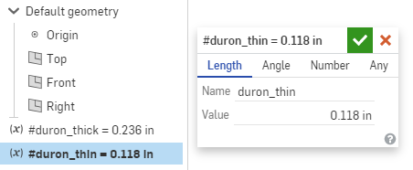

#### Sketch and Extrude The Base
Click  and start a sketch on the top plane. Alternatively, <kbd>Shift</kbd>+<kbd>s</kbd> is the shortcut for starting a sketch.
Drag a center-point rectangle (Shortcut: <kbd>r</kbd>) from the origin.
Dimension it (Shortcut: <kbd>d</kbd>) to 18 by 18 inches, and accept the sketch.

{}

We'll now turn the sketch into solid geometry.
Click "Extrude" (Shortcut: <kbd>Shift</kbd>+<kbd>e</kbd>).
For "faces and sketch regions", simply choose the sketch itself from the feature tree.
For the depth, type in "#duron_thick" to reference the variable you created earlier.

{}

#### Sketch the Sides
Start a sketch on the right face of the base you just extruded, and sketch and dimension the outline of the box.
Extrude, again selecting the sketch itself as the object. Make sure that the extrusion mode is set to "new" to create a new part, and not "add," which would merge the new extrusion with the base.
You should now have two parts that look like this:

Choose the mirror feature  from the toolbar, and mirror the side plate across the right plane, again using the "new" option rather than "add."

{}

{}
Generally, you want to avoid mirroring identical parts, instead modeling them once and then making copies in the assembly.  In this particular case, mirroring in the part studio helps with the laser-cutting workflow.  On an actual project your left and right sides will also likely be different.
{}

#### Sketch and Extrude The Cross Members
You can extrude multiple disjoint regions as part of a single sketch, and they'll all become parts. So for the cross members, we can do everything as a single sketch to define geometry, and then extrude regions from the same sketch in multiple operations.

Make a new sketch on the outside face of one of the side plates.
Sketch the vertical and horizontal components using corner rectangles (Shortcut: <kbd>r</kbd>).
For the two pieces along the angled line, sketch a couple of corner rectangles, and select the bottom horizontal line. This should highlight the constraints for that line. Delete the horizontal constraint, and then add a coincident constraint between the top line and the edge of the plate.

Add equality constraints to the thickness dimensions of all the rectangles, and then dimension one to be #duron_thick.

Extrude non-intersecting plates across the volume, using the "terminate at face" option to go to the outside face of the other side plate. I did the front, back, top spar, and one of the middle spars in one extrude, and the remaining parts in another operation. You'll have to un-hide the sketch after the first extrude to be able to select different regions from it the second time.



#### Sketch and Extrude Facing Plates
These plates will end up covering the insides of the box. For each, sketch and extrude a plate of thickness #duron_thin.
Your box should now look something like this:

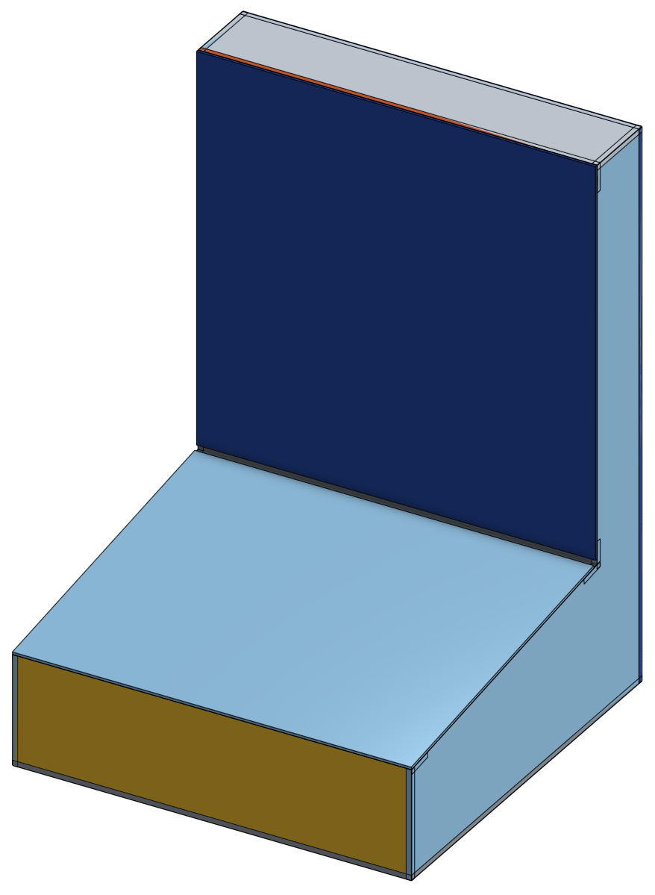

### Assemble and Create Connections

#### Assemble the Parts
In this particular case, we made all mirror copies of parts in the part studio.
However, for the sake of going through the process, we'll pull the parts into an assembly.

Create a new assembly, and then click , then simply select the entire part studio.
Click accept without clicking in the viewport to insert at the origin.
Right-click the base part and click "fix"&mdash;this constrains all degrees of freedom for that part.
You can now click  and select all parts to create a group constraint, which fixes all degrees of freedom between parts in the group.

If the sides were identical geometry, here's where you'd make multiple copies of them in the assembly.

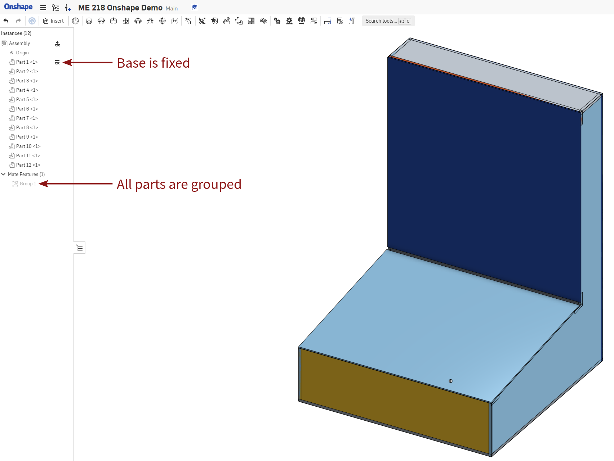

#### Create an In-Context Part Studio
This in-context part studio will allow us to make joints on the assembled components, as well as be the starting point for laying them out to cut.
From the assembly, click  to create a part studio from the assembly.
Once in the new part studio, create a Transform feature, and copy in place all of the components from the assembly context.
You can now hide the assembly context view and work with the local copies to add joints without affecting the parts in the assembly.

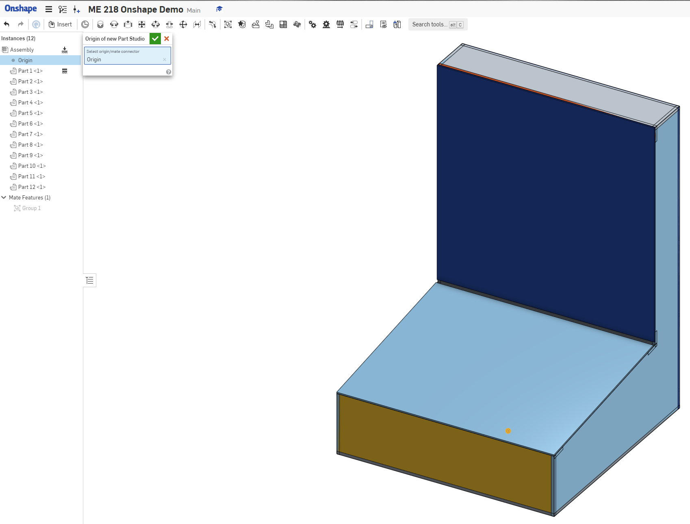

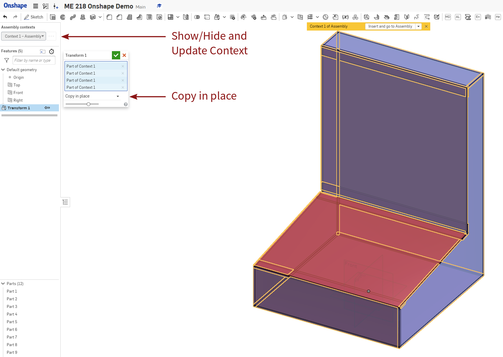

This link can be updated, but does not do so automatically. 
Updating the context can be done from the context menu at the top of the part studio feature tree.

#### Add T-Slot Connections for the Facing Plates
We want the facing plates to be removable so you can get at the insides. One way to do this, though by no means the only, is to use bolted edge connections through the facing plates into the edge plates.

Select T-Slot Joint from your custom feature toolbar. Select the edge face of the side plate, and set the joint parameters so you get connections where you want them. It may be helpful to hide the facing plates so you can easily select the edges to add the joints on.

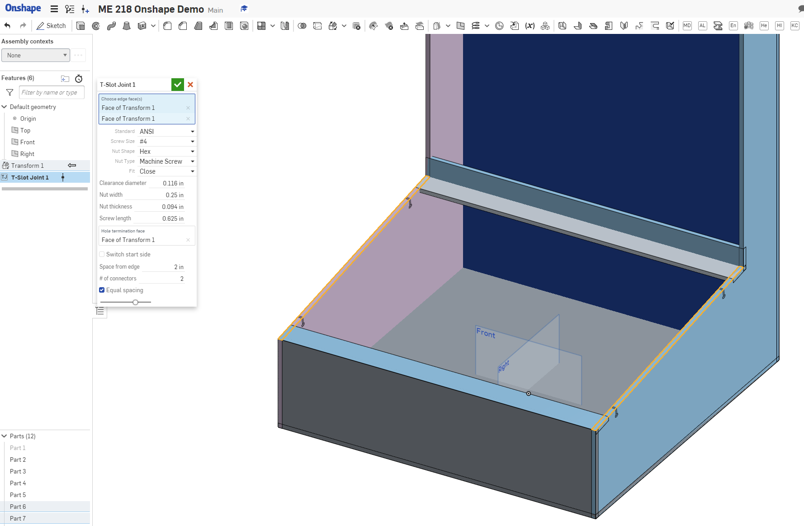

Repeat for all four edges.

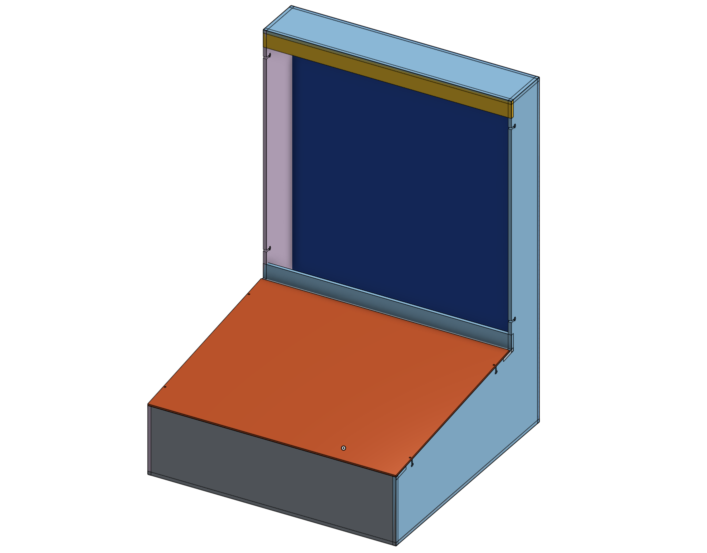

#### Laser Joint
Select the Laser Joint feature from your custom feature toolbar.
Select Automatic mode, then drag-select all of the non-facing parts. Enable adaptive pin sizing, and set the limits appropriately. I've found that for most work in ME218, the other options aren't necessary, but play around with them to get a feel for it. Leave Allowance disabled here to get a nice fit for your parts.

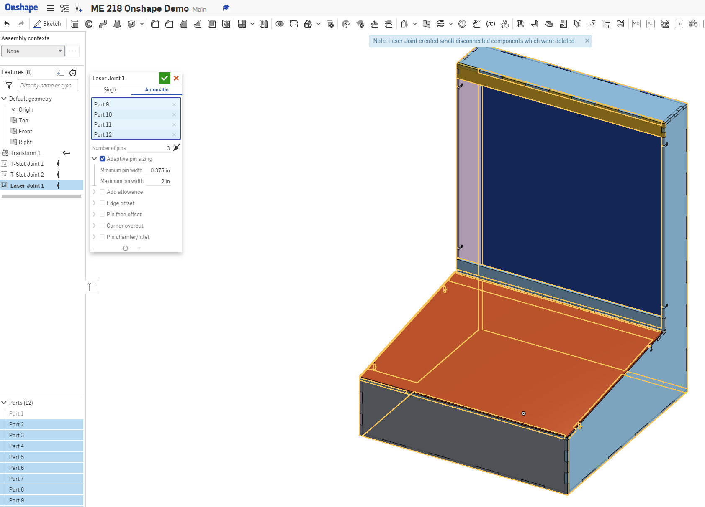

Note that it's notifying you that "Laser Joint created small disconnected components which were deleted."
This is something you might see if three[^complex] components all intersect in the same location at odd angles; sometimes this means that small triangles will be left unconnected to anything else after the joint.
Laser Joint will automatically remove anything it thinks is sufficiently small, but provides a warning in case it really matters.

[^complex]: Or, if you're, say, making an icosahedron, more than three.

Occasionally your configurations may result in zero-thickness geometry once the joints are computed; in this case, Laser Joint will fail.  
Try adjusting some of your joints to ensure that after computation of any joints there are no zero-thickness locations.

#### Kerf Compensation
The lasers on campus cut along the centerline. To get nominal-size parts, we'll offset the geometry a little so that everything lines up.

Add a Kerf Compensation feature, select the "By Thickness" mode, and enter one of the plate thicknesses you input earlier. I find that for / materials, using a kerf of  and an allowance of  works well; keep the same allowance and assume a  kerf for / parts. To be extra precise, cut a test square in your material on your laser and measure the kerf.

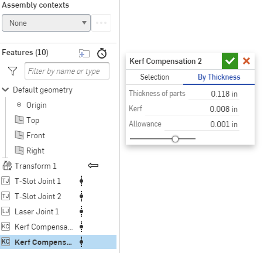

### Nest the Parts for Cutting
You now have an assembly with all joints computed, and you need to get them to a laser.  
Our first approach will be the Auto Layout feature, which uses a rectangular bin-packing algorithm to lay out all parts of a given thickness.
This can lead to inefficient packings, but is an excellent place to start, as it's the easiest option.

#### Auto Layout
Add an Auto Layout feature.
You have the option of defining the size of the sheet you will be cutting it from and the spacing to leave between parts.
The checkboxes allow you to make multiple copies of every part, and also to show the sheet outlines for convenience.
Multiple copies can be useful when making several copies of an identical subcomponent.
Note that the feature automatically lays out only flat parts of the thickness you have selected, and moves the remaining features out of the way.

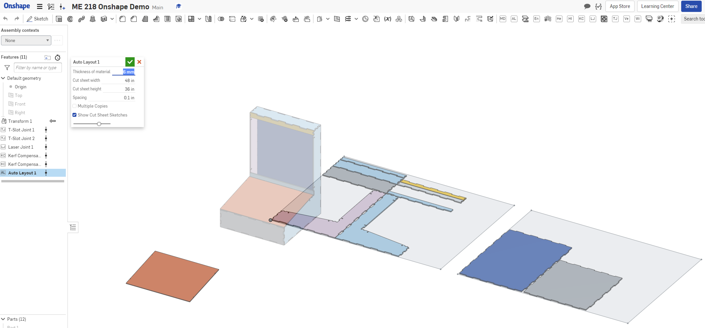

Repeat this procedure for each different thickness of part you want to cut.

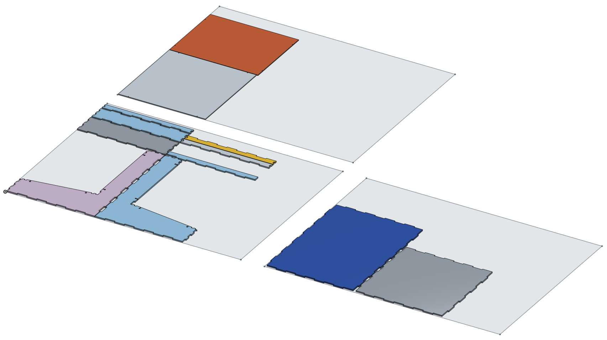

#### Create Drawings and Export DXFs
To create a drawing from an Auto Layout part studio, we'll make an Onshape drawing containing the required geometry.

Create a new drawing, selecting a custom format, large page size, and no annotations.

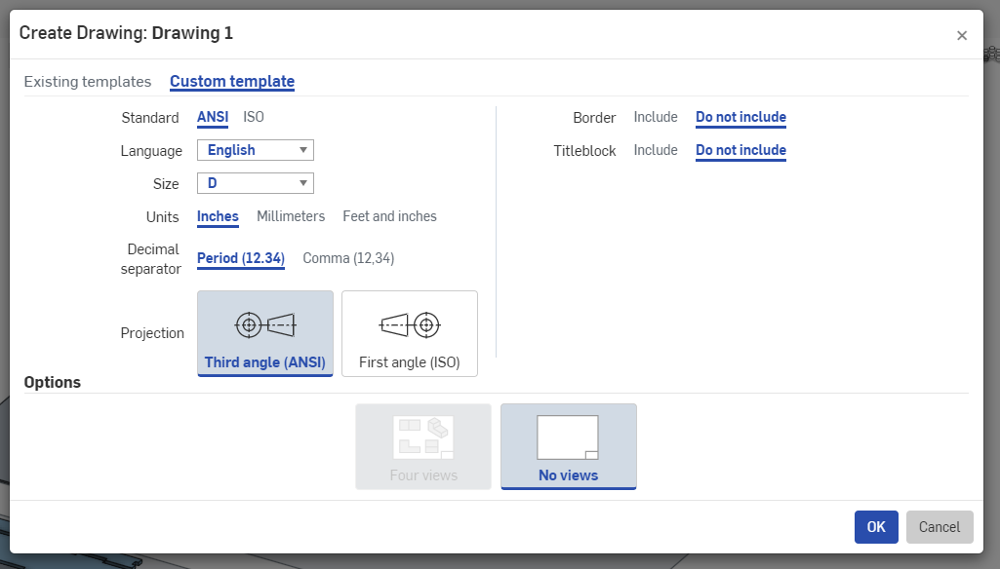

Now insert the top view of the entire part studio in which we added the joints and did the layout.
You'll need to check the leftmost input selection in order to directly add the entire part studio.
Make sure the scale is set to 1:1.

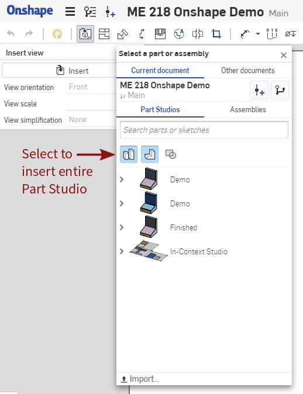

Now select the "crop" tool, and draw a spline around just one of the sheets that AutoLayout generated.

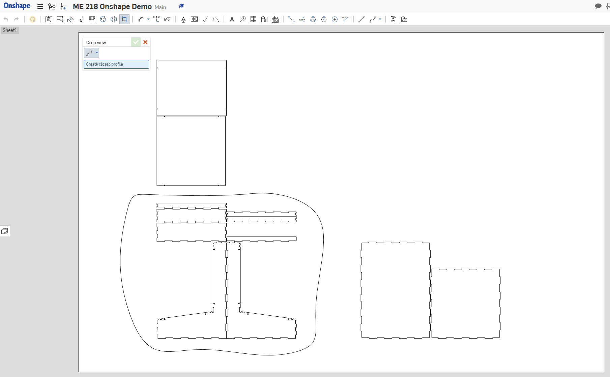
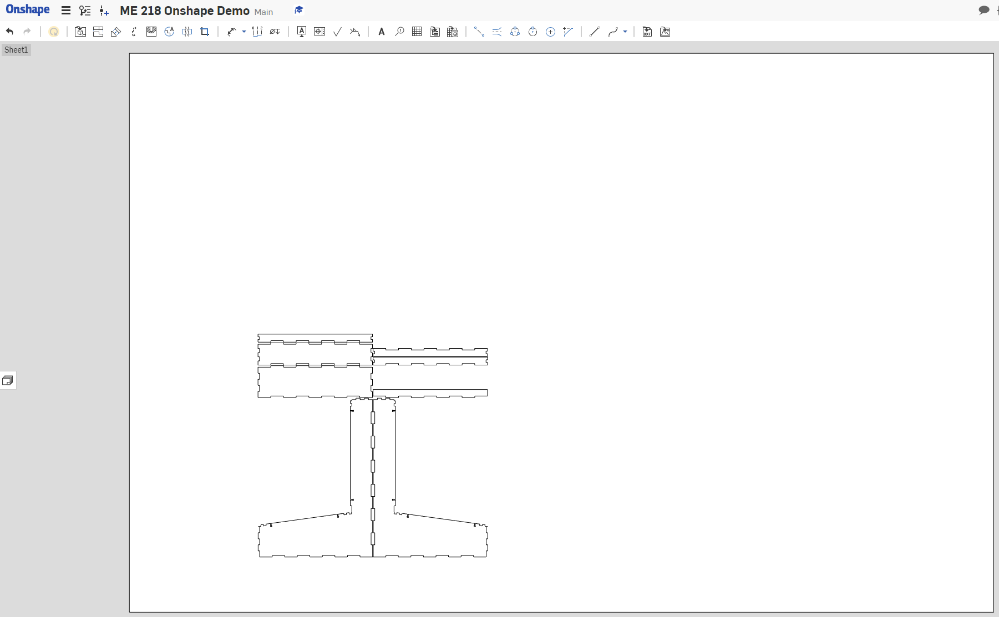

Now add a sheet to the drawing and repeat this insert view/crop procedure for each cut sheet that Auto Layout generated.

{}
There's other ways to assemble everything into discrete drawings and extract a DXF, including just right-clicking on a part and choosing "export as DXF."

Doing it this way, however, means that as long as the number of cut sheets generated by Auto Layout doesn't change, you can propagate design changes all the way through to the cropped drawing views without having to redo the setup portions of this process.
Especially when you end up making many small changes, this can make it significantly easier to recut entire assemblies.
{}

Before exporting as DXF, measure your actual stock and if necessary update the thickness variables defined at the top of the document. 
If you've been using those variables everywhere, this should be a really easy way to compensate for odd material thicknesses and get the joints sized so they almost snap-fit (e.g. I find the 1/4" Duron from PRL is usually not quite 1/4" or 6mm).

To export a single part, simply right-click a face and choose "Export as DXF/DWG..." and download. 
Since the laser joint is order dependent, symmetric parts will not necessarily have symmetric joints, so export each part individually.

If you're cutting the entire assembly, you can right-click the drawing tab in Onshape and export as either DXF or as a PDF, depending on which works better for your printer.

Now just throw it on a USB stick and head over to the laser cutter, you're all set to start making some parts.

{} 
So you're here because you've got a bunch of individual DXFs for each part. Now we need to lay these out efficiently so that we can make the most of the material when we cut. This operation is called "nesting."

Try to use the Auto Layout method detailed above if you can; it's much easier.
For more complex shapes though, you'll need to use an actual nesting solution. 

**SVGnest** is a free, open-source solution, but only accepts SVG files. To use this, you'd need to use something to convert your DXF to SVG and then nest. You can find it at [svgnest.com](https://svgnest.com/).

**Deepnest** is downloadable, and takes DXF input.  As of this writing, if is both free as in beer and free as in open source.  This is a more configurable version of the SVGnest algorithm, and tends to give better results on complicated geometries.  You will have to let it run for a while to get a near-optimal result, as it's based on a genetic algorithm solution. You can find it at [deepnest.io](https://deepnest.io/)
{}

---
Contributed by Arul Suresh, 4 May 2020.